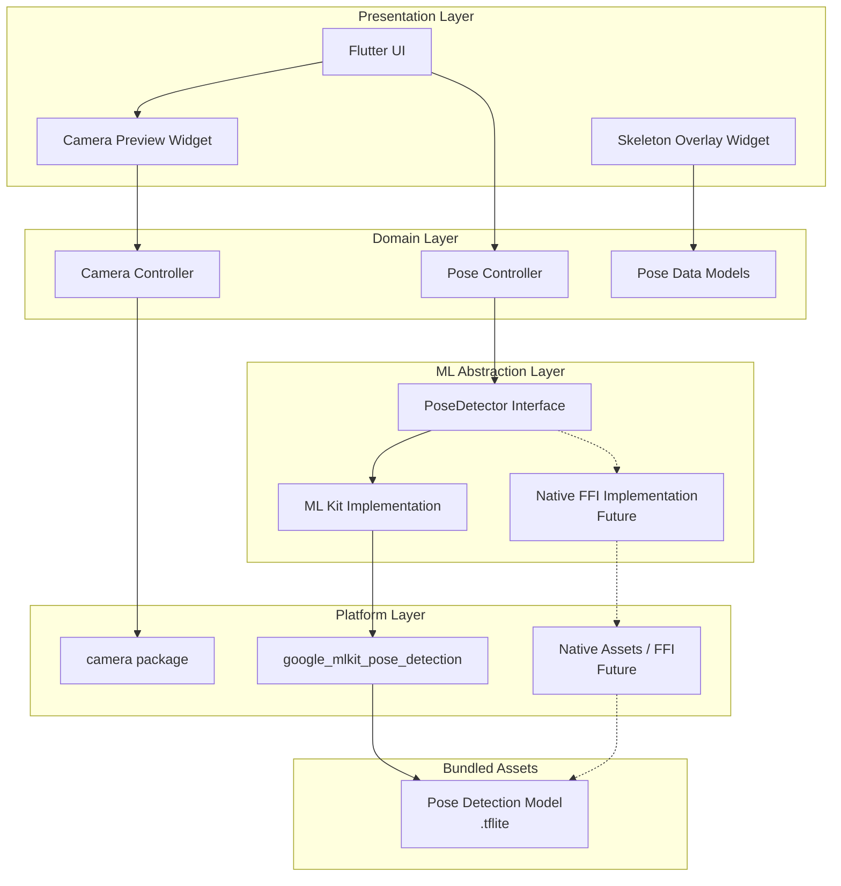
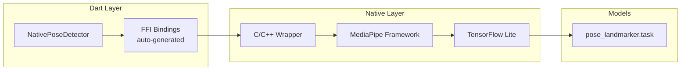
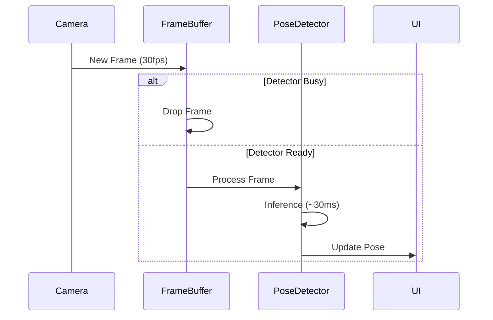
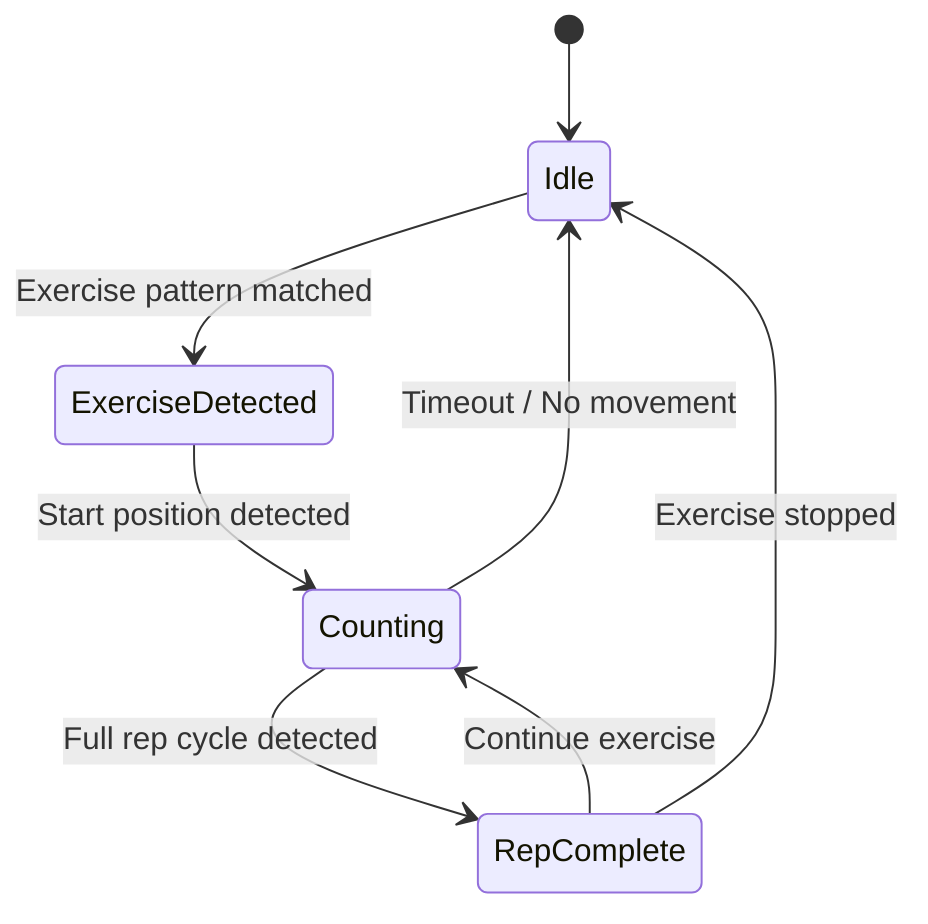
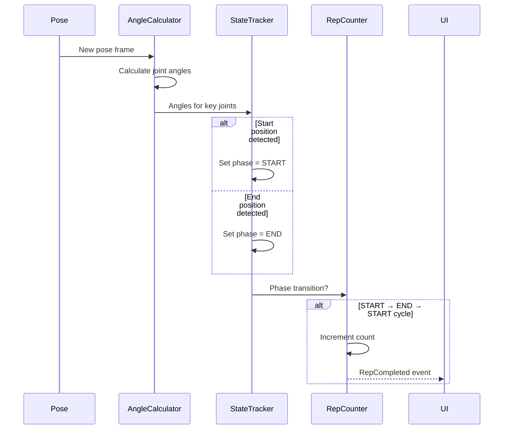
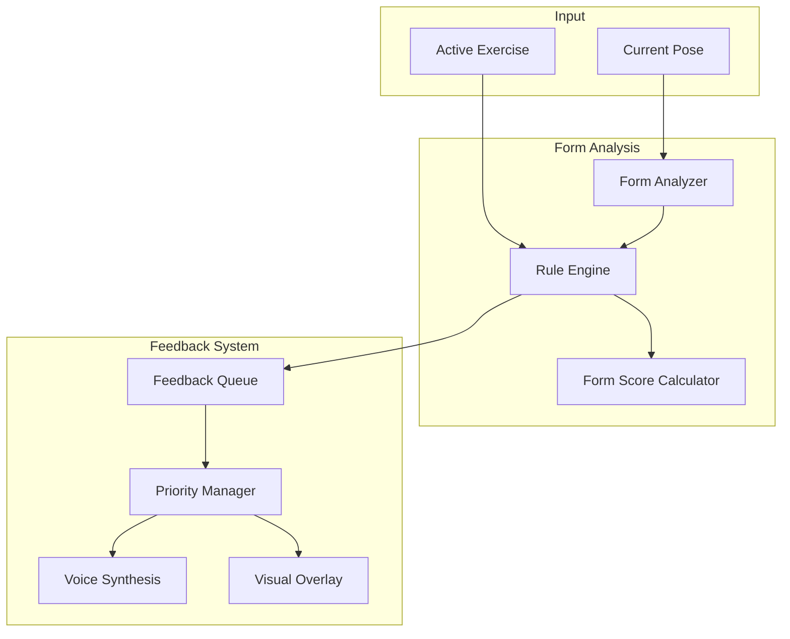

# FitnessPipe Architecture

## Overview

FitnessPipe is a cross-platform Flutter application for AI-powered fitness tracking using real-time human pose estimation. The app uses Google MediaPipe for pose detection and is designed to work offline, with all ML models bundled within the application.

### Target Platforms
- **iOS** (iPhone, iPad)
- **macOS** (Apple Silicon & Intel)
- **Android** (phones, tablets)

### Key Design Principles
1. **Offline-First**: All ML models bundled in the app (no Google Play Services dependency)
2. **China-Compatible**: No Firebase or Google Cloud dependencies
3. **Swappable ML Backend**: Abstract pose detection layer for future optimization
4. **Performance-Conscious**: Designed for real-time video processing

---

## System Architecture



---

## Core Components

### 1. Presentation Layer

#### Camera Preview Widget
Displays the live camera feed using Flutter's `camera` package.

```
lib/
└── presentation/
    ├── widgets/
    │   ├── camera_preview.dart
    │   └── skeleton_overlay.dart
    └── screens/
        └── pose_detection_screen.dart
```

#### Skeleton Overlay Widget
Renders the detected pose skeleton on top of the camera preview. Uses `CustomPainter` to draw:
- **33 Body Landmarks** (MediaPipe Pose model)
- **Bone connections** between landmarks
- **Confidence indicators** (optional)

### 2. Domain Layer

#### Pose Data Models

```dart
// Core pose representation
class Pose {
  final List<PoseLandmark> landmarks;
  final double confidence;
  final DateTime timestamp;
}

class PoseLandmark {
  final LandmarkType type;
  final double x;        // 0.0 - 1.0 (normalized)
  final double y;        // 0.0 - 1.0 (normalized)
  final double z;        // Depth (relative)
  final double confidence;
}

enum LandmarkType {
  nose,
  leftEyeInner, leftEye, leftEyeOuter,
  rightEyeInner, rightEye, rightEyeOuter,
  leftEar, rightEar,
  mouthLeft, mouthRight,
  leftShoulder, rightShoulder,
  leftElbow, rightElbow,
  leftWrist, rightWrist,
  leftPinky, rightPinky,
  leftIndex, rightIndex,
  leftThumb, rightThumb,
  leftHip, rightHip,
  leftKnee, rightKnee,
  leftAnkle, rightAnkle,
  leftHeel, rightHeel,
  leftFootIndex, rightFootIndex,
}
```

### 3. ML Abstraction Layer

> [!IMPORTANT]
> This abstraction layer is the key to enabling future migration from ML Kit to Native FFI (MediaPipe) without affecting the rest of the application.

#### PoseDetector Interface

```dart
/// Abstract interface for pose detection implementations
abstract class PoseDetector {
  /// Initialize the detector with configuration
  Future<void> initialize(PoseDetectorConfig config);
  
  /// Process a camera frame and return detected poses
  Future<List<Pose>> detectPoses(CameraImage image);
  
  /// Release resources
  Future<void> dispose();
  
  /// Check if the detector is ready
  bool get isInitialized;
}

class PoseDetectorConfig {
  final PoseDetectionMode mode;
  final bool enableTracking;
  final double minConfidence;
  
  const PoseDetectorConfig({
    this.mode = PoseDetectionMode.stream,
    this.enableTracking = true,
    this.minConfidence = 0.5,
  });
}

enum PoseDetectionMode {
  singleImage,  // For static images
  stream,       // For video/camera streams
}
```

#### Implementation Strategy

| Implementation | Package | Status | Use Case |
|----------------|---------|--------|----------|
| **ML Kit** | `google_mlkit_pose_detection` | ✅ Initial | Quick development, good accuracy |
| **Native FFI** | Custom (dart:ffi + Native Assets) | 🔮 Future | Maximum performance, lower latency |

---

## ML Kit Implementation (Phase 1)

### Package Selection

```yaml
dependencies:
  google_mlkit_pose_detection: ^0.12.0
  camera: ^0.11.0
```

> [!WARNING]
> **Offline Model Requirement**: For China compatibility, we must configure ML Kit to use bundled models instead of downloading from Google Play Services.

### Bundled Model Configuration

#### Android (`android/app/build.gradle`)

```groovy
android {
    // ...
    
    aaptOptions {
        noCompress "tflite"
    }
}

dependencies {
    // Use bundled model instead of dynamic download
    implementation 'com.google.mlkit:pose-detection:18.0.0-beta5'
    // Do NOT use: 'com.google.mlkit:pose-detection-accurate' (requires download)
}
```

#### Android Manifest

```xml
<application>
    <!-- Disable model download from Google Play Services -->
    <meta-data
        android:name="com.google.mlkit.vision.DEPENDENCIES"
        android:value="pose" />
    
    <!-- Use bundled model -->
    <meta-data
        android:name="com.google.firebase.ml.vision.DEPENDENCIES"
        android:value="pose" />
</application>
```

#### iOS (`ios/Podfile`)

```ruby
# Models are bundled by default on iOS
# No special configuration needed
```

### ML Kit PoseDetector Implementation

```dart
class MLKitPoseDetector implements PoseDetector {
  mlkit.PoseDetector? _detector;
  bool _isInitialized = false;

  @override
  Future<void> initialize(PoseDetectorConfig config) async {
    final options = mlkit.PoseDetectorOptions(
      mode: config.mode == PoseDetectionMode.stream
          ? mlkit.PoseDetectionMode.stream
          : mlkit.PoseDetectionMode.single,
    );
    _detector = mlkit.PoseDetector(options: options);
    _isInitialized = true;
  }

  @override
  Future<List<Pose>> detectPoses(CameraImage image) async {
    if (!_isInitialized) throw StateError('Detector not initialized');
    
    final inputImage = _convertToInputImage(image);
    final mlkitPoses = await _detector!.processImage(inputImage);
    
    return mlkitPoses.map(_convertPose).toList();
  }

  @override
  Future<void> dispose() async {
    await _detector?.close();
    _isInitialized = false;
  }

  @override
  bool get isInitialized => _isInitialized;

  // Conversion helpers...
}
```

---

## Native FFI Implementation (Future Phase)

> [!NOTE]
> This section outlines the future architecture for native MediaPipe integration using Dart FFI and Native Assets. **Do not implement this in Phase 1.**

### Why Native FFI?

| Aspect | ML Kit | Native FFI |
|--------|--------|------------|
| Latency | ~30-50ms | ~10-20ms |
| Control | Limited | Full |
| Model Customization | No | Yes |
| Memory Management | Automatic | Manual |
| Complexity | Low | High |

### Architecture for FFI Migration



### Native Assets Setup (Dart 3.2+)

```yaml
# pubspec.yaml
native_assets:
  builder:
    - src/native/build.dart
```

### Platform-Specific Builds

| Platform | Build System | Output |
|----------|-------------|--------|
| Android | CMake + NDK | `libmediapipe.so` |
| iOS | CMake + Xcode | `mediapipe.framework` |
| macOS | CMake + Xcode | `mediapipe.framework` |

### FFI Implementation Skeleton

```dart
class NativePoseDetector implements PoseDetector {
  late final DynamicLibrary _lib;
  late final Pointer<NativeDetectorHandle> _handle;

  @override
  Future<void> initialize(PoseDetectorConfig config) async {
    _lib = _loadLibrary();
    final initFn = _lib.lookupFunction<
        Pointer<NativeDetectorHandle> Function(Pointer<Utf8>),
        Pointer<NativeDetectorHandle> Function(Pointer<Utf8>)
    >('mediapipe_pose_init');
    
    final modelPath = await _getModelPath();
    _handle = initFn(modelPath.toNativeUtf8());
  }

  DynamicLibrary _loadLibrary() {
    if (Platform.isAndroid) {
      return DynamicLibrary.open('libmediapipe_pose.so');
    } else if (Platform.isIOS || Platform.isMacOS) {
      return DynamicLibrary.process();
    }
    throw UnsupportedError('Platform not supported');
  }

  // ... implementation details
}
```

---

## Project Structure

```
fitnessPipe/
├── android/
│   ├── app/
│   │   ├── src/main/
│   │   │   └── AndroidManifest.xml
│   │   └── build.gradle
│   └── build.gradle
├── ios/
│   ├── Podfile
│   └── Runner/
├── macos/
│   ├── Podfile
│   └── Runner/
├── lib/
│   ├── main.dart
│   ├── app.dart
│   ├── core/
│   │   ├── di/                      # Dependency injection
│   │   │   └── service_locator.dart
│   │   ├── utils/
│   │   │   ├── image_converter.dart
│   │   │   └── angle_calculator.dart
│   │   └── l10n/                    # Localization
│   │       └── feedback_strings.dart
│   ├── domain/
│   │   ├── models/
│   │   │   ├── pose.dart
│   │   │   ├── pose_landmark.dart
│   │   │   ├── exercise.dart
│   │   │   └── form_correction.dart
│   │   └── interfaces/
│   │       ├── pose_detector.dart
│   │       ├── exercise_analyzer.dart
│   │       └── form_analyzer.dart
│   ├── data/
│   │   ├── ml_kit/
│   │   │   └── ml_kit_pose_detector.dart
│   │   ├── native/                  # Future: FFI implementation
│   │   │   └── native_pose_detector.dart
│   │   └── exercises/               # Exercise definitions
│   │       ├── squat_definition.dart
│   │       ├── pushup_definition.dart
│   │       └── exercise_registry.dart
│   ├── features/
│   │   ├── exercise_counter/
│   │   │   ├── exercise_analyzer_impl.dart
│   │   │   ├── rep_state_machine.dart
│   │   │   └── angle_tracker.dart
│   │   └── form_correction/
│   │       ├── form_analyzer_impl.dart
│   │       ├── form_rules_engine.dart
│   │       ├── voice_feedback_service.dart
│   │       └── visual_hint_painter.dart
│   └── presentation/
│       ├── screens/
│       │   ├── pose_detection_screen.dart
│       │   └── workout_session_screen.dart
│       ├── widgets/
│       │   ├── camera_preview.dart
│       │   ├── skeleton_overlay.dart
│       │   ├── rep_counter_widget.dart
│       │   └── form_feedback_overlay.dart
│       └── controllers/
│           ├── camera_controller.dart
│           ├── pose_controller.dart
│           └── workout_controller.dart
├── assets/
│   ├── models/                      # Bundled ML models
│   │   └── pose_landmarker.tflite
│   └── audio/                       # Sound effects (optional)
│       └── rep_complete.mp3
├── src/
│   └── native/                      # Future: Native code
│       ├── build.dart
│       ├── mediapipe_wrapper.cpp
│       └── mediapipe_wrapper.h
├── docs/
│   └── architecture.md
├── test/
│   ├── unit/
│   │   ├── angle_calculator_test.dart
│   │   └── exercise_analyzer_test.dart
│   └── integration/
└── pubspec.yaml
```

---

## Dependency Injection

Use a simple service locator pattern for swapping implementations:

```dart
// lib/core/di/service_locator.dart

import 'package:get_it/get_it.dart';

final getIt = GetIt.instance;

enum MLBackend { mlKit, native }

void setupDependencies({MLBackend backend = MLBackend.mlKit}) {
  // Register pose detector based on backend choice
  switch (backend) {
    case MLBackend.mlKit:
      getIt.registerLazySingleton<PoseDetector>(
        () => MLKitPoseDetector(),
      );
      break;
    case MLBackend.native:
      getIt.registerLazySingleton<PoseDetector>(
        () => NativePoseDetector(),
      );
      break;
  }
}
```

---

## Camera Integration

### Camera Package Configuration

```yaml
dependencies:
  camera: ^0.11.0
```

### Platform Permissions

#### Android (`android/app/src/main/AndroidManifest.xml`)

```xml
<uses-permission android:name="android.permission.CAMERA" />
<uses-feature android:name="android.hardware.camera" />
<uses-feature android:name="android.hardware.camera.autofocus" />
```

#### iOS (`ios/Runner/Info.plist`)

```xml
<key>NSCameraUsageDescription</key>
<string>This app requires camera access for pose detection</string>
```

#### macOS (`macos/Runner/Info.plist` & Entitlements)

```xml
<!-- Info.plist -->
<key>NSCameraUsageDescription</key>
<string>This app requires camera access for pose detection</string>
```

```xml
<!-- DebugProfile.entitlements & Release.entitlements -->
<key>com.apple.security.device.camera</key>
<true/>
```

### Camera Selection (Multi-Camera Support)

```dart
class CameraService {
  List<CameraDescription> _cameras = [];
  CameraController? _controller;

  Future<void> initialize() async {
    _cameras = await availableCameras();
  }

  List<CameraDescription> get availableCameras => _cameras;

  Future<void> selectCamera(CameraDescription camera) async {
    await _controller?.dispose();
    _controller = CameraController(
      camera,
      ResolutionPreset.high,
      enableAudio: false,
      imageFormatGroup: Platform.isAndroid
          ? ImageFormatGroup.nv21
          : ImageFormatGroup.bgra8888,
    );
    await _controller!.initialize();
  }

  Stream<CameraImage> get imageStream {
    // Stream camera frames for pose detection
  }
}
```

---

## Performance Considerations

### Frame Processing Strategy



### Optimization Techniques

| Technique | Description | Impact |
|-----------|-------------|--------|
| **Frame Skipping** | Process every Nth frame if behind | Reduces CPU load |
| **Resolution Scaling** | Lower resolution for ML input | Faster inference |
| **Isolate Processing** | Run detection in separate isolate | UI responsiveness |
| **Caching** | Cache converted input images | Memory efficiency |

### Recommended Settings by Platform

| Platform | Resolution | Target FPS | Frame Skip |
|----------|-----------|------------|------------|
| iOS | 720p | 30 | None |
| Android (high-end) | 720p | 30 | None |
| Android (mid-range) | 480p | 24 | 1 |
| macOS | 1080p | 30 | None |

---

## Exercise Counting

The exercise counting feature tracks repetitions of common exercises by analyzing pose sequences over time.

### Architecture



### Exercise Analyzer Interface

```dart
/// Analyzes pose sequences to count exercise repetitions
abstract class ExerciseAnalyzer {
  /// Register an exercise definition
  void registerExercise(ExerciseDefinition exercise);
  
  /// Process a new pose frame
  ExerciseEvent? analyzePose(Pose pose);
  
  /// Get current exercise state
  ExerciseState get currentState;
  
  /// Reset the analyzer
  void reset();
}

class ExerciseState {
  final ExerciseType? activeExercise;
  final int repCount;
  final ExercisePhase phase;  // up, down, transition
  final double confidence;
}

enum ExerciseEvent {
  exerciseStarted,
  repCompleted,
  exercisePaused,
  exerciseStopped,
}
```

### Supported Exercises (Initial)

| Exercise | Key Landmarks | Detection Logic |
|----------|--------------|------------------|
| **Push-up** | Shoulders, Elbows, Wrists | Elbow angle: 180° → 90° → 180° |
| **Squat** | Hips, Knees, Ankles | Knee angle: 180° → 90° → 180° |
| **Jumping Jack** | Wrists, Ankles | Arms/legs spread ratio |
| **Lunge** | Hips, Knees, Ankles | Asymmetric knee bend detection |
| **Plank** | Shoulders, Hips, Ankles | Body alignment + hold time |

### Exercise Definition Model

```dart
class ExerciseDefinition {
  final ExerciseType type;
  final String name;
  final List<LandmarkType> keyLandmarks;
  final List<AngleConstraint> startPosition;
  final List<AngleConstraint> endPosition;
  final Duration minRepDuration;
  final Duration maxRepDuration;
  
  /// Custom validation for complex exercises
  final bool Function(Pose pose)? customValidator;
}

class AngleConstraint {
  final LandmarkType vertex;       // The angle point
  final LandmarkType pointA;       // First arm
  final LandmarkType pointB;       // Second arm
  final double minAngle;
  final double maxAngle;
}
```

### Rep Detection Algorithm



---

## Form Correction

Real-time voice and visual feedback to help users maintain proper exercise form.

### Architecture



### Form Analyzer Interface

```dart
abstract class FormAnalyzer {
  /// Analyze form for the current exercise
  FormAnalysisResult analyze(Pose pose, ExerciseType exercise);
  
  /// Get correction suggestions
  List<FormCorrection> getCorrections(Pose pose, ExerciseType exercise);
}

class FormAnalysisResult {
  final double overallScore;           // 0.0 - 1.0
  final Map<String, double> componentScores;  // Per-body-part scores
  final List<FormCorrection> corrections;
}

class FormCorrection {
  final FormIssue issue;
  final BodyPart affectedPart;
  final String feedbackMessage;         // "Squat down a bit more"
  final String voiceMessage;            // TTS-optimized version
  final CorrectionPriority priority;
  final VisualHint? visualHint;         // Arrow/highlight overlay
}

enum CorrectionPriority {
  critical,    // May cause injury
  important,   // Significantly reduces effectiveness
  minor,       // Optimization suggestion
}
```

### Form Rules (Examples)

| Exercise | Rule | Detection | Feedback |
|----------|------|-----------|----------|
| **Squat** | Knees over toes | Knee X vs Ankle X | "Keep knees behind toes" |
| **Squat** | Depth check | Hip-knee angle < 100° | "Squat down a bit more" |
| **Squat** | Back straight | Shoulder-hip-knee alignment | "Keep your back straight" |
| **Push-up** | Elbow flare | Elbow angle from body | "Keep elbows closer to body" |
| **Push-up** | Hip sag | Shoulder-hip-ankle line | "Raise your hips" |
| **Plank** | Hip pike | Hip position vs shoulder-ankle line | "Lower your hips" |

### Voice Feedback System

```dart
class VoiceFeedbackService {
  final FlutterTts _tts = FlutterTts();
  final Queue<FormCorrection> _feedbackQueue = Queue();
  
  Duration _minInterval = Duration(seconds: 3);  // Prevent spam
  DateTime? _lastFeedback;
  
  Future<void> initialize() async {
    await _tts.setLanguage('en-US');  // or 'zh-CN' for China
    await _tts.setSpeechRate(0.5);    // Slightly slower for clarity
  }
  
  void queueFeedback(FormCorrection correction) {
    // Only queue if priority is high enough and cooldown elapsed
    if (_shouldSpeak(correction)) {
      _feedbackQueue.add(correction);
      _processQueue();
    }
  }
  
  void _processQueue() async {
    if (_feedbackQueue.isEmpty) return;
    
    final correction = _feedbackQueue.removeFirst();
    await _tts.speak(correction.voiceMessage);
    _lastFeedback = DateTime.now();
  }
}
```

### Visual Feedback Overlay

```dart
class FormCorrectionPainter extends CustomPainter {
  final Pose pose;
  final List<FormCorrection> corrections;
  
  @override
  void paint(Canvas canvas, Size size) {
    for (final correction in corrections) {
      if (correction.visualHint != null) {
        _drawCorrectionHint(canvas, correction.visualHint!);
      }
    }
  }
  
  void _drawCorrectionHint(Canvas canvas, VisualHint hint) {
    // Draw arrows, highlights, or target zones
    // to guide user toward correct position
  }
}
```

### Localization for China

> [!NOTE]
> Voice feedback must support Chinese (Mandarin) for the China market.

```dart
// Feedback messages localization
class FormFeedbackStrings {
  static const Map<FormIssue, Map<String, String>> messages = {
    FormIssue.squatDepth: {
      'en': 'Squat down a bit more',
      'zh': '再蹲低一点',
    },
    FormIssue.kneesOverToes: {
      'en': 'Keep knees behind toes',
      'zh': '膝盖不要超过脚尖',
    },
    FormIssue.backStraight: {
      'en': 'Keep your back straight',
      'zh': '保持背部挺直',
    },
    // ... more messages
  };
}
```

---

## China Compatibility Checklist

> [!CAUTION]
> These requirements are critical for the app to function in China where Google services are blocked.

| Requirement | Solution | Status |
|-------------|----------|--------|
| No Google Play Services | Bundle ML models | ✅ Designed |
| No Firebase | Use local storage / custom backend | ✅ Designed |
| No Google Cloud APIs | All processing on-device | ✅ Designed |
| No dynamic model download | Static model in APK/IPA | ✅ Designed |
| App Store approval (China) | Separate build configuration | 📋 Planned |

### Build Variants

```groovy
// android/app/build.gradle

android {
    flavorDimensions "market"
    
    productFlavors {
        global {
            dimension "market"
            applicationIdSuffix ".global"
        }
        china {
            dimension "market"
            applicationIdSuffix ".cn"
            // Ensure no Google dependencies
        }
    }
}
```

---

## Development Phases

### Phase 1: MVP (Current)
- [x] Architecture design
- [ ] Basic camera integration
- [ ] ML Kit pose detection (bundled model)
- [ ] Skeleton overlay rendering
- [ ] Multi-camera support (macOS)

### Phase 2: Exercise Counting
- [ ] Angle calculation utilities
- [ ] Rep state machine implementation
- [ ] Squat detection & counting
- [ ] Push-up detection & counting
- [ ] Rep counter UI widget
- [ ] Test with real exercises

### Phase 3: Form Correction
- [ ] Form rules engine
- [ ] Voice feedback service (TTS)
- [ ] Chinese language support
- [ ] Visual correction hints overlay
- [ ] Per-exercise form rules
- [ ] Feedback priority & throttling

### Phase 4: Polish & UX
- [ ] Performance optimization
- [ ] UI/UX improvements
- [ ] Workout session screen
- [ ] Pose recording/playback
- [ ] Export capabilities

### Phase 5: Native Performance (Future)
- [ ] MediaPipe FFI bindings
- [ ] Native Assets integration
- [ ] Performance benchmarking
- [ ] Gradual migration from ML Kit

---

## Testing Strategy

### Unit Tests
- Pose data model transformations
- Coordinate normalization
- Landmark filtering

### Integration Tests
- Camera permission handling
- Pose detector initialization
- Frame processing pipeline

### Platform Tests
- iOS Simulator (limited - no real camera)
- Android Emulator (virtual camera)
- Physical devices (recommended for ML testing)

---

## References

- [MediaPipe Pose Landmarker](https://ai.google.dev/mediapipe/solutions/vision/pose_landmarker)
- [Google ML Kit Pose Detection](https://developers.google.com/ml-kit/vision/pose-detection)
- [Flutter Camera Package](https://pub.dev/packages/camera)
- [Dart FFI](https://dart.dev/interop/c-interop)
- [Native Assets](https://dart.dev/interop/c-interop#native-assets)
