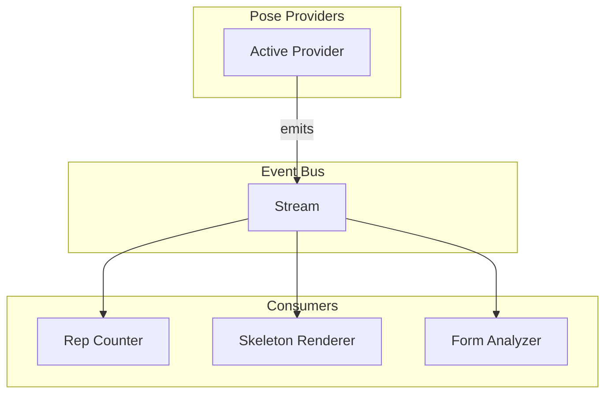

# Issue #23: Modular Separation of Counter and Pose Estimation

> **Issue**: [Architecture: modular separation of counter and pose estimation](https://github.com/jinzishuai/fitnessPipe/issues/23)  
> **Created**: 2026-01-11  
> **Author**: Architecture Discussion Document

---

## 1. Problem Statement

The issue proposes that the **rep counter code should be independent of the human pose estimation code**, enabling:
- Use of the same counter logic against both MediaPipe and Apple Vision implementations
- Easy swapping between different pose estimation backends
- Flexibility to experiment with different ML approaches without rewriting business logic

---

## 2. Current Architecture Analysis

### What We Already Have

Looking at the existing codebase, we already have a **good foundation** for abstraction:

```
lib/
├── domain/
│   ├── interfaces/
│   │   └── pose_detector.dart      ← Abstract PoseDetector interface
│   └── models/
│       ├── pose.dart               ← Provider-agnostic Pose model
│       └── pose_landmark.dart      ← Provider-agnostic landmarks
└── data/
    └── ml_kit/
        └── ml_kit_pose_detector.dart  ← ML Kit implementation
```

The `Pose` and `PoseLandmark` models are already **provider-agnostic** — they don't depend on ML Kit or any specific framework. This is the correct abstraction layer for the counter to consume.

### The Key Question

The counter code (not yet implemented) will need to:
1. Receive pose data
2. Calculate angles between joints
3. Track state transitions (up position → down position → rep complete)
4. Count repetitions

**The question is: What interface should the counter depend on?**

---

## 3. Architecture Options

### Option A: Counter Consumes `Pose` Directly (Recommended)

```mermaid
graph LR
    subgraph "Pose Providers"
        MLKit[ML Kit Provider]
        Vision[Apple Vision Provider]
        MediaPipe[MediaPipe Provider]
    end
    
    subgraph "Canonical Model"
        Pose[Pose Model]
    end
    
    subgraph "Counter"
        Counter[Rep Counter]
    end
    
    MLKit --> |converts to| Pose
    Vision --> |converts to| Pose
    MediaPipe --> |converts to| Pose
    Pose --> Counter
```

**How it works:**
- Each pose provider converts its native output to the canonical `Pose` model
- The counter only knows about `Pose` — it's completely decoupled from the provider
- Adding a new provider requires only implementing the conversion

**Pros:**
- ✅ Simple and clear
- ✅ We already have this structure in place
- ✅ `Pose` model is already provider-agnostic
- ✅ Easy to unit test counter with mock poses

**Cons:**
- ⚠️ Assumes all providers produce compatible landmark indices (they do — MediaPipe standard is universal)

---

### Option B: Counter Consumes an Abstract `PoseData` Interface

```mermaid
graph LR
    subgraph "Pose Providers"
        MLKit[ML Kit Provider]
        Vision[Apple Vision Provider]
    end
    
    subgraph "Abstraction"
        PoseData["PoseData Interface<br/>(getLandmark, getAngle)"]
    end
    
    subgraph "Counter"
        Counter[Rep Counter]
    end
    
    MLKit --> |implements| PoseData
    Vision --> |implements| PoseData
    PoseData --> Counter
```

**How it works:**
- Define an abstract interface that exposes **only what the counter needs**
- Each provider directly implements this interface
- Counter codes against the interface

**Pros:**
- ✅ Providers have flexibility in internal representation
- ✅ Interface Segregation Principle (counter only sees what it needs)

**Cons:**
- ⚠️ More complex to implement
- ⚠️ We'd lose the convenience of having a unified `Pose` model
- ⚠️ Testing becomes harder (need to mock the interface, not just create Pose objects)

---

### Option C: Event-Driven Architecture with Streams



**How it works:**
- Pose providers emit `Pose` events to a stream
- Multiple consumers (counter, skeleton renderer, form analyzer) subscribe
- Decoupling via stream makes adding/removing consumers trivial

**Pros:**
- ✅ Highly decoupled
- ✅ Easy to add new consumers
- ✅ Natural fit for real-time camera processing

**Cons:**
- ⚠️ More infrastructure to set up
- ⚠️ Debugging stream subscriptions can be tricky
- ⚠️ May be overkill for current app complexity

---

## 4. Questions for You

Before proceeding, I'd like your input on these design decisions:

### Question 1: Pose Provider Strategy

Which pose estimation backends do you want to support?

| Provider | Platform Support | Notes |
|----------|-----------------|-------|
| **ML Kit** | iOS, Android | ✅ Already implemented |
| **Apple Vision** | iOS, macOS | Native, potentially better on Apple Silicon |
| **MediaPipe (Direct)** | All | Via FFI, more complex but full control |

**Are you planning to support Apple Vision as a pose provider?** If so, this becomes more critical to get right now.

---

### Question 2: Landmark Compatibility

Different providers may output different landmark sets:

| Provider | Landmark Count | Standard |
|----------|---------------|----------|
| ML Kit / MediaPipe | 33 | MediaPipe Pose |
| Apple Vision | 19 (body) + hands + face | Apple VNHumanBodyPoseObservation |

**How should we handle landmark differences?**

A) **Map Apple Vision to MediaPipe format** (lose some Apple-specific landmarks)
B) **Define a minimal common set** (only landmarks needed for exercises)
C) **Support both schemas** with adapters

---

### Question 3: Counter Input Granularity

What should the counter receive?

A) **Raw Pose** — Counter calculates its own angles and positions
B) **Processed JointAngles** — Pre-calculated angles per frame
C) **Both** — Pose for flexibility, with helper utilities for angle calculation

```dart
// Option A: Counter receives Pose
class RepCounter {
  void processPose(Pose pose) {
    final elbowAngle = _calculateAngle(
      pose.getLandmark(LandmarkType.shoulder),
      pose.getLandmark(LandmarkType.elbow),
      pose.getLandmark(LandmarkType.wrist),
    );
    // ... state machine logic
  }
}

// Option B: Counter receives pre-calculated angles
class RepCounter {
  void processAngles(JointAngles angles) {
    if (angles.elbow < 90) {
      // ... state machine logic  
    }
  }
}
```

---

### Question 4: Multiple Exercise Support

Should the counter architecture support:

A) **One exercise at a time** (user selects exercise before workout)
B) **Auto-detection** (system detects which exercise user is doing)
C) **Both** (auto-detect with ability to lock to specific exercise)

This affects whether we need an exercise classifier before the counter.

---

### Question 5: State Persistence

Should the counter maintain state across:

A) **Session only** (resets when screen changes)
B) **Workout session** (persists during a defined workout)
C) **App lifetime** (resume counts even after app restart)

---

## 5. Recommended Approach

Based on my analysis, I recommend:

1. **Keep the existing `Pose` model as the canonical interface** — it's already provider-agnostic
2. **Add an Apple Vision provider** that converts to the same `Pose` model
3. **Build the counter against `Pose`** — no new abstractions needed
4. **Use dependency injection** to swap providers (we could use `get_it` as mentioned in architecture.md)

This gives us the modular separation requested in the issue with minimal additional complexity.

---

## 6. Next Steps (After Your Input)

1. Document the final architecture decision
2. Define the provider interface contract more precisely
3. Create the Apple Vision pose detector (if needed)
4. Implement the rep counter with the agreed interface
5. Add unit tests for the counter using mock poses

---

> **Please review the questions above and share your thoughts. Your answers will shape the implementation plan.**

---

## 7. Code Organization: Separate Repo?

This is a key architectural decision. Let me lay out the options:

### Option A: Monorepo (Keep in FitnessPipe)

```
fitnessPipe/
├── lib/
│   ├── core/
│   │   └── counter/              ← Counter logic lives here
│   │       ├── rep_counter.dart
│   │       ├── exercise_state_machine.dart
│   │       └── angle_calculator.dart
│   ├── domain/
│   │   └── models/               ← Shared models
│   └── data/
│       └── ml_kit/
```

**Pros:**
- ✅ Simpler development workflow
- ✅ Easier refactoring across boundaries
- ✅ No package versioning overhead

**Cons:**
- ⚠️ Harder to reuse in other projects
- ⚠️ Tighter coupling temptation

---

### Option B: Separate Package (Same Repo, Published)

```
fitnessPipe/
├── packages/
│   └── fitness_counter/          ← Standalone Dart/Flutter package
│       ├── lib/
│       │   ├── src/
│       │   │   ├── rep_counter.dart
│       │   │   └── state_machine.dart
│       │   └── fitness_counter.dart  ← Public API
│       ├── pubspec.yaml
│       └── test/
├── lib/                          ← Main app consumes the package
└── pubspec.yaml                  ← depends on path: packages/fitness_counter
```

**Pros:**
- ✅ Clear API boundary enforced by package structure
- ✅ Can publish to pub.dev later
- ✅ Easy to test in isolation
- ✅ Single repo, simpler CI

**Cons:**
- ⚠️ Slightly more setup

---

### Option C: Completely Separate Repository

```
# Repo 1: fitness-counter
fitness-counter/
├── lib/
│   └── fitness_counter.dart
├── pubspec.yaml
└── test/

# Repo 2: fitnessPipe (consumes via pub)
fitnessPipe/
├── pubspec.yaml  # depends on: fitness_counter: ^1.0.0
└── lib/
```

**Pros:**
- ✅ Maximum reusability (other apps can use it)
- ✅ Forces clean API design
- ✅ Independent versioning and release cycle

**Cons:**
- ⚠️ More overhead (two repos, coordinated releases)
- ⚠️ Harder to iterate quickly in early development
- ⚠️ Need to publish (or use git dependency)

---

### My Recommendation

**Start with Option B (separate package, same repo)**, then extract to separate repo later if needed.

This gives you:
- Clean boundaries from day one
- Easy local development
- Option to publish when stable

---

## 8. Input/Output Interface Design

This is the most important part. The counter package should define a **minimal, stable contract**.

### Input: What Goes In?

#### Option 1: Raw Landmark Positions (Minimal)

```dart
/// A single point in 3D space with confidence
class Landmark {
  final double x;      // 0.0 - 1.0 normalized
  final double y;      // 0.0 - 1.0 normalized  
  final double z;      // Relative depth
  final double confidence;
}

/// Named landmarks the counter cares about
class PoseFrame {
  final Map<String, Landmark> landmarks;
  final DateTime timestamp;
  
  Landmark? get leftShoulder => landmarks['left_shoulder'];
  Landmark? get leftElbow => landmarks['left_elbow'];
  // ... etc
}
```

**Pros:** Maximum flexibility, works with any pose provider
**Cons:** Counter must calculate angles internally

#### Option 2: Pre-Calculated Angles

```dart
/// Joint angles already calculated
class JointAngles {
  final double? leftElbow;    // degrees 0-180
  final double? rightElbow;
  final double? leftKnee;
  final double? rightKnee;
  final double? leftHip;
  final double? rightHip;
  final DateTime timestamp;
}
```

**Pros:** Simpler counter logic, provider does the math
**Cons:** Less flexible, provider must know which angles matter

#### Option 3: Hybrid (Recommended)

```dart
/// Input to the counter - provider-agnostic
class PoseFrame {
  /// Raw landmarks for flexibility
  final Map<LandmarkId, Landmark> landmarks;
  
  /// Timestamp for temporal analysis
  final DateTime timestamp;
  
  /// Frame dimensions (for aspect ratio awareness)
  final Size frameSize;
}

/// Standard landmark identifiers (subset of MediaPipe 33)
enum LandmarkId {
  leftShoulder, rightShoulder,
  leftElbow, rightElbow,
  leftWrist, rightWrist,
  leftHip, rightHip,
  leftKnee, rightKnee,
  leftAnkle, rightAnkle,
  // Only include what's needed for exercise counting
}
```

**Why this works:**
- Only 12-16 landmarks needed (not all 33)
- Apple Vision can map to this subset
- MediaPipe/ML Kit provides superset
- Counter library provides angle calculation utilities

---

### Output: What Comes Out?

```dart
/// Events emitted by the counter
abstract class CounterEvent {}

class RepCompleted extends CounterEvent {
  final int totalReps;
  final Duration repDuration;
  final double quality;  // 0.0 - 1.0 form score
}

class ExerciseStarted extends CounterEvent {
  final ExerciseType exercise;
}

class ExercisePaused extends CounterEvent {
  final Duration pauseDuration;
}

class PhaseChanged extends CounterEvent {
  final ExercisePhase phase;  // up, down, transition
}

/// State query (not event-driven)
class CounterState {
  final ExerciseType? activeExercise;
  final int repCount;
  final ExercisePhase currentPhase;
  final double currentAngle;  // Primary angle being tracked
}
```

---

## 9. Language Choice

### Option A: Pure Dart (Recommended for Flutter Integration)

```dart
// Package: fitness_counter (pure Dart, no Flutter dependency)
library fitness_counter;

export 'src/rep_counter.dart';
export 'src/models/pose_frame.dart';
export 'src/models/counter_event.dart';
```

**Pros:**
- ✅ Native integration with FitnessPipe (Flutter/Dart)
- ✅ No bridging overhead
- ✅ Single language codebase
- ✅ Easy to test
- ✅ Works on all Flutter platforms

**Cons:**
- ⚠️ Can't reuse in non-Dart projects (Swift-only iOS, Kotlin-only Android)

---

### Option B: Platform-Native (Swift/Kotlin)

Implement counter twice:
- `ios/RepCounter.swift`
- `android/RepCounter.kt`

**Pros:**
- ✅ Could integrate with native-only apps
- ✅ No Dart runtime needed

**Cons:**
- ❌ Duplicate logic, maintenance burden
- ❌ Inconsistent behavior risk
- ❌ Doesn't make sense for a Flutter app

---

### Option C: Shared Native Core (C++/Rust via FFI)

```
fitness-counter-core/     ← C++ or Rust library
├── src/
│   └── rep_counter.cpp
└── bindings/
    ├── dart/            ← FFI bindings for Flutter
    ├── swift/           ← Swift wrapper
    └── kotlin/          ← Kotlin/JNI wrapper
```

**Pros:**
- ✅ Single implementation, multiple platforms
- ✅ Maximum performance
- ✅ Could be used outside Flutter ecosystem

**Cons:**
- ❌ Much more complex to build and maintain
- ❌ FFI overhead for simple logic
- ❌ Overkill for angle calculations and state machines

---

### My Recommendation: **Pure Dart Package**

Given that:
1. FitnessPipe is a Flutter app
2. The counter logic is mostly math (angles) and state machines
3. No heavy computation that needs native performance
4. You want fast iteration

**A pure Dart package is the pragmatic choice.**

If you later want to reuse in a non-Flutter context, the logic is simple enough to port.

---

## 10. Proposed Package Structure

```
packages/fitness_counter/
├── lib/
│   ├── fitness_counter.dart          ← Public API exports
│   └── src/
│       ├── models/
│       │   ├── landmark.dart         ← Input: Landmark, PoseFrame
│       │   ├── landmark_id.dart      ← Enum of landmark identifiers
│       │   └── counter_event.dart    ← Output: RepCompleted, etc.
│       ├── exercises/
│       │   ├── exercise_definition.dart
│       │   ├── squat.dart
│       │   └── pushup.dart
│       ├── core/
│       │   ├── rep_counter.dart      ← Main API entry point
│       │   ├── state_machine.dart    ← Rep detection FSM
│       │   └── angle_calculator.dart ← Geometric utilities
│       └── utils/
│           └── smoothing.dart        ← Signal smoothing
├── test/
│   ├── rep_counter_test.dart
│   ├── angle_calculator_test.dart
│   └── fixtures/
│       └── sample_poses.dart         ← Test data
├── pubspec.yaml
├── README.md
└── CHANGELOG.md
```

---

## 11. Updated Questions

Based on your input, here are refined questions:

### Q1: Repository Strategy
Do you prefer:
- **A)** Separate package in same repo (`packages/fitness_counter/`)
- **B)** Completely separate repository (e.g., `jinzishuai/fitness-counter`)

### Q2: Landmark Set
Which landmarks should the counter require as input? (I suggest a minimal set of ~12)

| Landmark | Needed For |
|----------|------------|
| Shoulders | Push-up, plank alignment |
| Elbows | Push-up depth |
| Wrists | Push-up, jumping jack |
| Hips | Squat, lunge, plank |
| Knees | Squat, lunge |
| Ankles | Squat, jumping jack |

### Q3: Output Events
What information do you want when a rep completes?
- Just count?
- Rep duration?
- Form quality score?
- Phase breakdown (time in up/down position)?

### Q4: Exercise Definitions
Should exercise definitions be:
- **A)** Built into the package (squat, pushup, etc.)
- **B)** Configurable by the app (define your own exercises)
- **C)** Both (built-in defaults + custom support)
