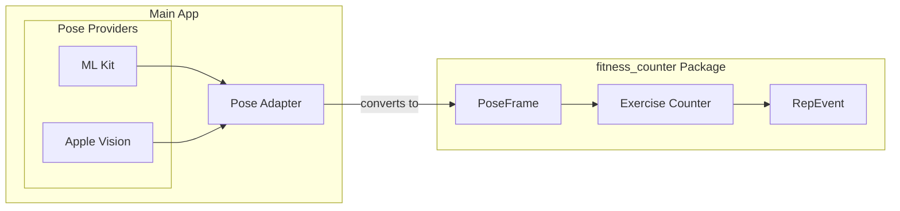
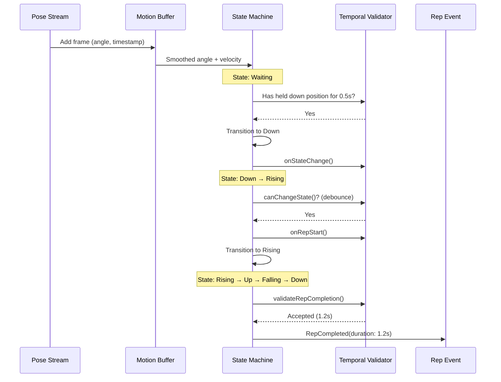

# Issue #23: Modular Separation of Counter and Pose Estimation

> **Issue**: [Architecture: modular separation of counter and pose estimation](https://github.com/jinzishuai/fitnessPipe/issues/23)  
> **Created**: 2026-01-11  
> **Status**: ✅ Design Approved

---

## Confirmed Decisions

| Decision | Choice |
|----------|--------|
| **Language** | Pure Dart |
| **Code Organization** | Separate package in same repo (`packages/fitness_counter/`) |
| **Landmark Strategy** | Package defines all 33, each exercise declares its minimum required set |
| **Interface** | Counter defines its own `PoseFrame` type (not the app's `Pose` model) |

---

## 1. Problem Statement

The rep counter code should be **independent of the human pose estimation code**, enabling:
- Use of the same counter logic against both ML Kit and Apple Vision implementations
- Easy swapping between different pose estimation backends
- Flexibility to experiment with different ML approaches without rewriting business logic

---

## 2. Architecture Overview

### The Key Insight

The counter package should define its **own models** (`PoseFrame`, `Landmark`, `LandmarkId`) that are completely independent of any pose provider. The main app is responsible for converting from the provider's format to the counter's format.



### Why This Matters

1. **Complete decoupling**: The `fitness_counter` package has **zero dependencies** on ML Kit, Apple Vision, or the main app's models
2. **Testability**: Unit tests can create `PoseFrame` objects directly without any pose provider
3. **Flexibility**: Each exercise can declare exactly which landmarks it needs
4. **Clean API boundary**: The package defines a stable contract that won't change when we swap providers

---

## 3. Per-Exercise Landmark Requirements

Each exercise counter declares which landmarks it needs. The package defines **all possible landmarks** (MediaPipe 33), but exercises only use what they require.

### Full Landmark Enum (in package)

```dart
/// Full set available (matches MediaPipe 33)
enum LandmarkId {
  // Face
  nose, 
  leftEyeInner, leftEye, leftEyeOuter,
  rightEyeInner, rightEye, rightEyeOuter,
  leftEar, rightEar,
  mouthLeft, mouthRight,
  
  // Upper body
  leftShoulder, rightShoulder,
  leftElbow, rightElbow,
  leftWrist, rightWrist,
  
  // Hands
  leftPinky, rightPinky,
  leftIndex, rightIndex,
  leftThumb, rightThumb,
  
  // Core
  leftHip, rightHip,
  
  // Lower body
  leftKnee, rightKnee,
  leftAnkle, rightAnkle,
  leftHeel, rightHeel,
  leftFootIndex, rightFootIndex,
}
```

### Exercise-Specific Requirements

```dart
/// Base interface for exercise counters
abstract class ExerciseCounter {
  /// Landmarks this exercise requires
  Set<LandmarkId> get requiredLandmarks;
  
  /// Process a pose frame
  RepEvent? processPose(PoseFrame frame);
  
  /// Current state
  CounterState get state;
  
  /// Reset counter
  void reset();
}

/// Lateral Raise only needs 6 landmarks
class LateralRaiseCounter extends ExerciseCounter {
  @override
  Set<LandmarkId> get requiredLandmarks => {
    LandmarkId.leftShoulder, LandmarkId.rightShoulder,
    LandmarkId.leftElbow, LandmarkId.rightElbow,
    LandmarkId.leftHip, LandmarkId.rightHip,
  };
  
  // ... implementation
}

/// Squat needs hips, knees, ankles
class SquatCounter extends ExerciseCounter {
  @override
  Set<LandmarkId> get requiredLandmarks => {
    LandmarkId.leftHip, LandmarkId.rightHip,
    LandmarkId.leftKnee, LandmarkId.rightKnee,
    LandmarkId.leftAnkle, LandmarkId.rightAnkle,
  };
}

/// Yoga pose might need head tracking
class TreePoseCounter extends ExerciseCounter {
  @override
  Set<LandmarkId> get requiredLandmarks => {
    LandmarkId.nose,  // Head position for balance
    LandmarkId.leftShoulder, LandmarkId.rightShoulder,
    LandmarkId.leftHip, LandmarkId.rightHip,
    LandmarkId.leftKnee, LandmarkId.rightKnee,
    LandmarkId.leftAnkle, LandmarkId.rightAnkle,
  };
}
```

### Benefits of This Approach

| Benefit | Description |
|---------|-------------|
| **Extensibility** | New exercises can request any landmarks they need |
| **Validation** | Counter can check if all required landmarks are present |
| **Minimal coupling** | Exercises only depend on what they need |
| **Provider flexibility** | Works with any provider that can supply the required landmarks |

---

## 4. The Adapter Pattern

The main app converts from the pose provider's format to the counter's `PoseFrame`:

```dart
/// In the main app (NOT in the fitness_counter package)
import 'package:fitness_counter/fitness_counter.dart';
import '../domain/models/pose.dart' as app;

class PoseAdapter {
  /// Convert app's Pose to counter's PoseFrame
  PoseFrame convert(app.Pose pose) {
    final landmarks = <LandmarkId, Landmark>{};
    
    for (final poseLandmark in pose.landmarks) {
      final id = _mapLandmarkType(poseLandmark.type);
      if (id != null) {
        landmarks[id] = Landmark(
          x: poseLandmark.x,
          y: poseLandmark.y,
          z: poseLandmark.z,
          confidence: poseLandmark.confidence,
        );
      }
    }
    
    return PoseFrame(
      landmarks: landmarks,
      timestamp: pose.timestamp,
    );
  }
  
  LandmarkId? _mapLandmarkType(app.LandmarkType type) {
    // Map app's LandmarkType to counter's LandmarkId
    const mapping = {
      app.LandmarkType.nose: LandmarkId.nose,
      app.LandmarkType.leftShoulder: LandmarkId.leftShoulder,
      app.LandmarkType.rightShoulder: LandmarkId.rightShoulder,
      // ... etc
    };
    return mapping[type];
  }
}
```

---

## 5. Package Structure

```
packages/fitness_counter/
├── lib/
│   ├── fitness_counter.dart          ← Public API exports
│   └── src/
│       ├── models/
│       │   ├── landmark.dart         ← Landmark, LandmarkId
│       │   ├── pose_frame.dart       ← PoseFrame
│       │   └── counter_event.dart    ← RepEvent, RepCompleted, etc.
│       ├── core/
│       │   ├── exercise_counter.dart ← Abstract base class
│       │   ├── angle_calculator.dart ← Geometric utilities
│       │   ├── state_machine.dart    ← Generic rep detection FSM
│       │   └── smoothing.dart        ← Signal smoothing (EMA)
│       └── exercises/
│           ├── lateral_raise.dart    ← LateralRaiseCounter
│           ├── squat.dart            ← SquatCounter (future)
│           └── pushup.dart           ← PushupCounter (future)
├── test/
│   ├── lateral_raise_test.dart
│   ├── angle_calculator_test.dart
│   └── fixtures/
│       └── sample_poses.dart         ← Test data
├── pubspec.yaml
├── README.md
└── CHANGELOG.md
```

---

## 6. Input/Output Contract

### Input: PoseFrame

```dart
/// A single point in normalized 3D space
class Landmark {
  final double x;          // 0.0 - 1.0 normalized
  final double y;          // 0.0 - 1.0 normalized
  final double z;          // Relative depth
  final double confidence; // 0.0 - 1.0
  
  bool get isVisible => confidence > 0.5;
}

/// A frame of pose data
class PoseFrame {
  final Map<LandmarkId, Landmark> landmarks;
  final DateTime timestamp;
  
  /// Check if all required landmarks are present and visible
  bool hasLandmarks(Set<LandmarkId> required) {
    return required.every((id) => 
      landmarks[id]?.isVisible ?? false
    );
  }
}
```

### Output: RepEvent

```dart
/// Events emitted by the counter
sealed class RepEvent {}

class ExerciseStarted extends RepEvent {}

class RepCompleted extends RepEvent {
  final int totalReps;
  final Duration repDuration;
  final double peakAngle;
}

class PhaseChanged extends RepEvent {
  final ExercisePhase phase;
  final double currentAngle;
}
```

---

## 7. Time Series & Motion Buffer

Real-world pose data is noisy and arrives as a stream of frames. We need temporal analysis to:
1. **Smooth noisy signals** — Filter out jitter
2. **Track motion direction** — Is the angle increasing or decreasing?
3. **Calculate velocity** — How fast is the movement?
4. **Validate rep timing** — Reject impossibly fast/slow reps
5. **Detect momentum** — Is the user swinging or controlling the weight?

### 7.1 Motion Buffer (Sliding Window)

Keep track of the last N frames to analyze motion over time:

```dart
class MotionBuffer {
  final int maxSize;
  final Queue<FrameSnapshot> _buffer = Queue();
  
  MotionBuffer({this.maxSize = 30}); // ~1 second at 30fps
  
  void addFrame(PoseFrame frame, double primaryAngle) {
    _buffer.add(FrameSnapshot(
      timestamp: frame.timestamp,
      angle: primaryAngle,
    ));
    
    // Keep buffer size bounded
    while (_buffer.length > maxSize) {
      _buffer.removeFirst();
    }
  }
  
  /// Get frames from the last N milliseconds
  List<FrameSnapshot> getWindow(Duration duration) {
    final cutoff = DateTime.now().subtract(duration);
    return _buffer.where((f) => f.timestamp.isAfter(cutoff)).toList();
  }
  
  /// Clear the buffer (on exercise reset)
  void clear() => _buffer.clear();
}

class FrameSnapshot {
  final DateTime timestamp;
  final double angle;
  
  const FrameSnapshot({
    required this.timestamp,
    required this.angle,
  });
}
```

### 7.2 Velocity Calculation

Use the motion buffer to calculate angular velocity:

```dart
class VelocityCalculator {
  /// Calculate velocity using the last few frames
  /// Returns degrees per second (positive = increasing, negative = decreasing)
  double? calculateVelocity(MotionBuffer buffer, {int frameWindow = 5}) {
    final frames = buffer.getWindow(Duration(milliseconds: 200));
    if (frames.length < 2) return null;
    
    // Use first and last of the window
    final first = frames.first;
    final last = frames.last;
    
    final deltaAngle = last.angle - first.angle;
    final deltaTime = last.timestamp.difference(first.timestamp).inMilliseconds / 1000.0;
    
    if (deltaTime <= 0) return null;
    return deltaAngle / deltaTime;  // degrees/second
  }
  
  /// Moving direction based on recent velocity
  MovementDirection getDirection(double velocity) {
    if (velocity > 10) return MovementDirection.rising;
    if (velocity < -10) return MovementDirection.falling;
    return MovementDirection.stationary;
  }
}

enum MovementDirection { rising, falling, stationary }
```

### 7.3 Signal Smoothing (EMA)

Apply Exponential Moving Average to reduce noise:

```dart
class AngleSmoother {
  double _smoothedAngle = 0;
  final double alpha;  // 0.0-1.0, higher = more responsive, more noise
  
  AngleSmoother({this.alpha = 0.3});
  
  double smooth(double rawAngle) {
    _smoothedAngle = alpha * rawAngle + (1 - alpha) * _smoothedAngle;
    return _smoothedAngle;
  }
  
  void reset() => _smoothedAngle = 0;
}
```

### 7.4 Temporal Validation

Use timing to validate reps and transitions:

```dart
class TemporalValidator {
  DateTime? _repStartTime;
  DateTime? _lastStateChange;
  
  // Timing thresholds
  static const Duration minRepDuration = Duration(milliseconds: 500);
  static const Duration maxRepDuration = Duration(seconds: 5);
  static const Duration debounceTime = Duration(milliseconds: 100);
  static const Duration readyHoldTime = Duration(milliseconds: 500);
  
  /// Call when rep cycle starts (entering Rising phase)
  void onRepStart() {
    _repStartTime = DateTime.now();
  }
  
  /// Validate if a rep completion should be counted
  ValidationResult validateRepCompletion() {
    if (_repStartTime == null) {
      return ValidationResult.rejected('No rep in progress');
    }
    
    final duration = DateTime.now().difference(_repStartTime!);
    
    if (duration < minRepDuration) {
      return ValidationResult.rejected('Too fast (${duration.inMilliseconds}ms)');
    }
    
    if (duration > maxRepDuration) {
      return ValidationResult.rejected('Timed out');
    }
    
    return ValidationResult.accepted(duration);
  }
  
  /// Debounce state transitions to prevent jitter
  bool canChangeState() {
    if (_lastStateChange == null) return true;
    return DateTime.now().difference(_lastStateChange!) > debounceTime;
  }
  
  void onStateChange() {
    _lastStateChange = DateTime.now();
  }
  
  /// Check if user has held a position long enough
  bool hasHeldPosition(DateTime? holdStart, Duration required) {
    if (holdStart == null) return false;
    return DateTime.now().difference(holdStart) >= required;
  }
}

class ValidationResult {
  final bool isValid;
  final String? reason;
  final Duration? duration;
  
  const ValidationResult.accepted(this.duration) 
      : isValid = true, reason = null;
  const ValidationResult.rejected(this.reason) 
      : isValid = false, duration = null;
}
```

### 7.5 How Timing Affects Counting

The state machine uses temporal information at key decision points:



### 7.6 Velocity-Based Decisions (Advanced)

Use velocity to make smarter counting decisions:

```dart
class SmartStateMachine {
  final MotionBuffer _buffer;
  final VelocityCalculator _velocityCalc;
  
  RepEvent? processFrame(PoseFrame frame, double angle) {
    _buffer.addFrame(frame, angle);
    
    final velocity = _velocityCalc.calculateVelocity(_buffer);
    final direction = _velocityCalc.getDirection(velocity ?? 0);
    
    // Example: Only count transition to Rising if actually moving up
    if (_phase == Phase.down && angle > risingThreshold) {
      if (direction == MovementDirection.rising) {
        // Genuine upward motion - start counting
        _phase = Phase.rising;
      } else {
        // Angle crossed threshold but not actively moving up
        // Might be noise or partial movement - wait
      }
    }
    
    // Example: Detect swinging (too fast)
    if (velocity != null && velocity.abs() > 300) {
      // User is swinging the weight, not controlling it
      // Could flag for form feedback (future feature)
    }
    
    return null;
  }
}
```

### 7.7 Summary: Time-Based Parameters

| Parameter | Default | Purpose |
|-----------|---------|---------|
| `bufferSize` | 30 frames | ~1 second of history |
| `smoothingAlpha` | 0.3 | EMA noise filter strength |
| `minRepDuration` | 500ms | Reject impossibly fast reps |
| `maxRepDuration` | 5s | Timeout incomplete reps |
| `debounceTime` | 100ms | Prevent state jitter |
| `readyHoldTime` | 500ms | Time to hold start position |
| `velocityWindow` | 200ms | Window for velocity calculation |
| `maxVelocity` | 300°/s | Flag momentum-based swinging |

---

## 8. Language Choice: Pure Dart ✅

Given that:
1. FitnessPipe is a Flutter app
2. The counter logic is mostly math (angles) and state machines
3. No heavy computation requiring native performance
4. Want fast iteration

**A pure Dart package is the pragmatic choice.**

---

## 9. Code Organization: Separate Package in Same Repo ✅

```
fitnessPipe/
├── packages/
│   └── fitness_counter/          ← Standalone Dart package
│       ├── lib/
│       ├── test/
│       └── pubspec.yaml
├── lib/                          ← Main app consumes the package
└── pubspec.yaml                  ← depends on path: packages/fitness_counter
```

**Benefits:**
- ✅ Clear API boundary enforced by package structure
- ✅ Can publish to pub.dev later
- ✅ Easy to test in isolation
- ✅ Single repo, simpler CI

---

## 10. How This Answers the Original Questions

| Question | Answer |
|----------|--------|
| **Consume Pose directly?** | No — counter defines its own `PoseFrame` type |
| **12 landmarks enough?** | Package defines all 33, each exercise picks what it needs |
| **Provider differences?** | Adapter in main app handles conversion |
| **Counter input granularity?** | Raw landmarks; counter calculates angles internally |
| **Output events?** | `RepCompleted` with count, duration, peak angle |
| **Exercise definitions** | Per-exercise counter classes, each with its own requirements |

---

## 11. Next Steps

1. [x] Finalize architecture decisions (this document)
2. [ ] Create `packages/fitness_counter/` package structure
3. [ ] Implement `Landmark`, `PoseFrame`, `LandmarkId` models
4. [ ] Implement `LateralRaiseCounter` per the lateral raise design doc
5. [ ] Create adapter in main app to convert `Pose` → `PoseFrame`
6. [ ] Add unit tests for the counter
7. [ ] Integrate with the app UI

---

## Related Documents

- [Lateral Raise Counter Design](./lateral-raise-counter-design.md) — Detailed algorithm for the MVP exercise
