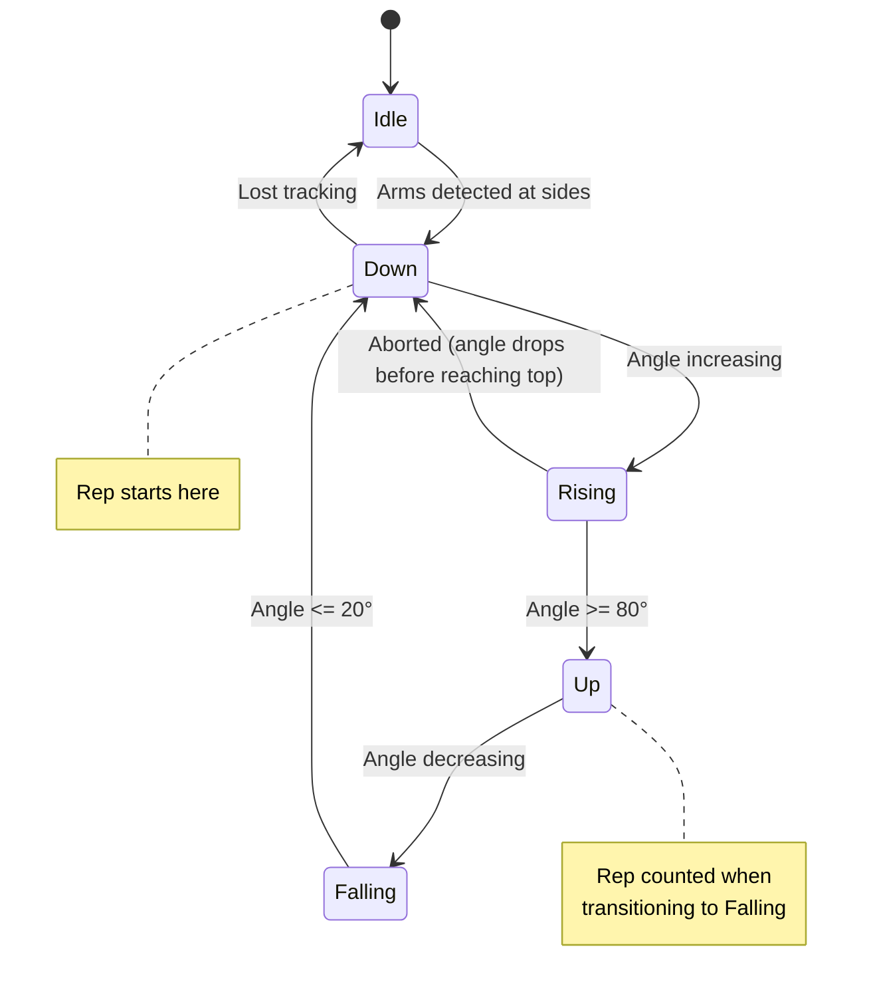
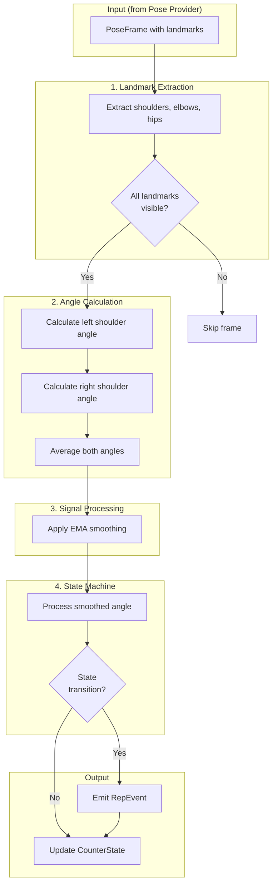

# Lateral Raise Counter Design

> **Issue**: [MVP: Count the reps of Lateral Raises](https://github.com/jinzishuai/fitnessPipe/issues/21)  
> **Related**: [Issue #23 - Modular Architecture](https://github.com/jinzishuai/fitnessPipe/issues/23)  
> **Created**: 2026-01-11  
> **Status**: ✅ Design Approved

---

## Confirmed Decisions

| Decision | Answer |
|----------|--------|
| **When to count rep** | When arms return to bottom position |
| **Arm requirement** | Both arms must move together |
| **MVP scope** | Just rep counts (no form feedback) |
| **Thresholds** | Hardcode defaults, but design for easy exposure later |

---

## 1. Exercise Overview

### What is a Lateral Raise?

A lateral raise (also called side raise) is a shoulder isolation exercise where the arms are raised out to the sides until approximately shoulder height, then lowered back down.

```
    START POSITION              END POSITION (top)
    
         O                           O
        /|\                        --|--
        / \                         / \
    (arms down)              (arms horizontal)
```

### Key Movement Characteristics

| Phase | Arm Position | Shoulder Angle |
|-------|-------------|----------------|
| **Start/Bottom** | Arms at sides | ~0-15° |
| **Top** | Arms horizontal | ~80-100° |
| **Full ROM** | Side to shoulder height | 0° → 90° → 0° |

---

## 2. Landmarks Required

For lateral raise detection, we need a **minimal subset** of pose landmarks:

```
        Nose (optional, for facing detection)
          |
    L Shoulder --- R Shoulder
         |              |
    L Elbow        R Elbow
         |              |
    L Wrist        R Wrist
         |              |
    L Hip  -------- R Hip
```

### Required Landmarks (6 minimum)

| Landmark | ID | Purpose |
|----------|-----|---------|
| `leftShoulder` | 11 | Angle vertex for left arm |
| `rightShoulder` | 12 | Angle vertex for right arm |
| `leftElbow` | 13 | Arm direction (left) |
| `rightElbow` | 14 | Arm direction (right) |
| `leftHip` | 23 | Body reference (left) |
| `rightHip` | 24 | Body reference (right) |

### Optional (for enhanced detection)

| Landmark | Purpose |
|----------|---------|
| `leftWrist` / `rightWrist` | Arm extension validation |
| `nose` | Facing direction detection |

---

## 3. Angle Calculation

### Primary Angle: Shoulder Abduction Angle

The key metric is the angle between the **upper arm** and the **torso**.

```
                  * Elbow
                 /
                /  θ (shoulder angle)
               /
    Shoulder *----------* Hip (torso line)
```

#### Mathematical Formula

For the **left arm**:

```
Vector A = Elbow - Shoulder     (arm direction)
Vector B = Hip - Shoulder       (torso direction, pointing down)

θ = arccos( (A · B) / (|A| × |B|) )
```

In code:

```dart
/// Calculate the shoulder abduction angle (arm raised from body)
double calculateShoulderAngle({
  required Landmark shoulder,
  required Landmark elbow,
  required Landmark hip,
}) {
  // Vector from shoulder to elbow (arm direction)
  final armX = elbow.x - shoulder.x;
  final armY = elbow.y - shoulder.y;
  
  // Vector from shoulder to hip (torso direction)
  final torsoX = hip.x - shoulder.x;
  final torsoY = hip.y - shoulder.y;
  
  // Dot product
  final dot = armX * torsoX + armY * torsoY;
  
  // Magnitudes
  final armMag = sqrt(armX * armX + armY * armY);
  final torsoMag = sqrt(torsoX * torsoX + torsoY * torsoY);
  
  // Angle in radians, then convert to degrees
  final cosAngle = dot / (armMag * torsoMag);
  final angleRad = acos(cosAngle.clamp(-1.0, 1.0));
  
  return angleRad * 180 / pi;  // Convert to degrees
}
```

### Handling Both Arms

For lateral raises, we should track **both arms** and use the average or require both to move:

```dart
class LateralRaiseAngles {
  final double leftShoulderAngle;
  final double rightShoulderAngle;
  
  /// Average angle of both arms
  double get averageAngle => (leftShoulderAngle + rightShoulderAngle) / 2;
  
  /// Are both arms reasonably synchronized?
  bool get armsSymmetric => 
      (leftShoulderAngle - rightShoulderAngle).abs() < 20; // degrees
}
```

---

## 4. State Machine Design

### States



### State Definitions

| State | Condition | Description |
|-------|-----------|-------------|
| **Idle** | No pose detected | Waiting for person |
| **Down** | Angle < 20° | Arms at sides, ready position |
| **Rising** | Angle increasing, 20° < angle < 80° | Lifting phase |
| **Up** | Angle >= 80° | Top of movement |
| **Falling** | Angle decreasing, 20° < angle < 80° | Lowering phase |

### Transition Logic

```dart
enum LateralRaisePhase { idle, down, rising, up, falling }

class LateralRaiseStateMachine {
  LateralRaisePhase _phase = LateralRaisePhase.idle;
  int _repCount = 0;
  double _lastAngle = 0;
  
  static const double _bottomThreshold = 20.0;  // degrees
  static const double _topThreshold = 80.0;     // degrees
  static const double _hysteresis = 5.0;        // prevent jitter
  
  /// Process a new angle reading
  RepEvent? processAngle(double angle) {
    RepEvent? event;
    
    switch (_phase) {
      case LateralRaisePhase.idle:
        if (angle < _bottomThreshold) {
          _phase = LateralRaisePhase.down;
          event = RepEvent.exerciseStarted;
        }
        break;
        
      case LateralRaisePhase.down:
        if (angle > _bottomThreshold + _hysteresis) {
          _phase = LateralRaisePhase.rising;
        }
        break;
        
      case LateralRaisePhase.rising:
        if (angle >= _topThreshold) {
          _phase = LateralRaisePhase.up;
        } else if (angle < _bottomThreshold) {
          // Aborted rep - went back down without reaching top
          _phase = LateralRaisePhase.down;
        }
        break;
        
      case LateralRaisePhase.up:
        if (angle < _topThreshold - _hysteresis) {
          _phase = LateralRaisePhase.falling;
        }
        break;
        
      case LateralRaisePhase.falling:
        if (angle <= _bottomThreshold) {
          _phase = LateralRaisePhase.down;
          _repCount++;
          event = RepEvent.repCompleted;
        } else if (angle >= _topThreshold) {
          // Went back up without completing
          _phase = LateralRaisePhase.up;
        }
        break;
    }
    
    _lastAngle = angle;
    return event;
  }
  
  int get repCount => _repCount;
  LateralRaisePhase get phase => _phase;
}
```

---

## 5. Signal Processing

### Problem: Noisy Pose Data

Raw pose detection produces noisy angle readings:

```
Frame 1: 45.2°
Frame 2: 48.7°  ← spike
Frame 3: 44.8°
Frame 4: 45.5°
Frame 5: 43.1°  ← dip
```

This causes false state transitions.

### Solution: Exponential Moving Average (EMA)

```dart
class AngleSmoother {
  double _smoothedAngle = 0;
  final double _alpha;  // Smoothing factor (0-1)
  
  /// Higher alpha = more responsive, more noise
  /// Lower alpha = smoother, more lag
  AngleSmoother({double alpha = 0.3}) : _alpha = alpha;
  
  double smooth(double rawAngle) {
    _smoothedAngle = _alpha * rawAngle + (1 - _alpha) * _smoothedAngle;
    return _smoothedAngle;
  }
}
```

### Recommended Settings

| Scenario | Alpha | Latency | Noise Rejection |
|----------|-------|---------|-----------------|
| Fast movements | 0.5 | Low | Lower |
| Normal (default) | 0.3 | Medium | Good |
| Very noisy | 0.15 | Higher | Excellent |

---

## 6. Temporal Safeguards

Time-based validation prevents false positives and handles edge cases.

### 6.1 Minimum Rep Duration

Reject impossibly fast reps (likely noise):

```dart
static const Duration _minRepDuration = Duration(milliseconds: 500);

DateTime? _repStartTime;

RepEvent? processAngle(double angle) {
  // When transitioning from Down to Rising, start timer
  if (_phase == LateralRaisePhase.down && angle > _bottomThreshold) {
    _repStartTime = DateTime.now();
  }
  
  // When completing rep, check duration
  if (repCompleted) {
    final duration = DateTime.now().difference(_repStartTime!);
    if (duration < _minRepDuration) {
      // Too fast - likely noise, don't count
      return null;
    }
    return RepCompleted(repCount: ++_count, duration: duration);
  }
}
```

### 6.2 Maximum Rep Duration (Timeout)

Reset if someone holds position too long or stops mid-rep:

```dart
static const Duration _maxRepDuration = Duration(seconds: 5);

void _checkTimeout() {
  if (_repStartTime != null) {
    if (DateTime.now().difference(_repStartTime!) > _maxRepDuration) {
      // Reset - they probably stopped exercising
      _phase = LateralRaisePhase.idle;
      _repStartTime = null;
    }
  }
}
```

### 6.3 Debounce at Thresholds

Prevent rapid oscillation when angle hovers near threshold boundaries:

```dart
DateTime? _lastStateChange;
static const Duration _debounceTime = Duration(milliseconds: 100);

bool _canChangeState() {
  if (_lastStateChange == null) return true;
  return DateTime.now().difference(_lastStateChange!) > _debounceTime;
}

// In state transition logic:
if (_canChangeState() && angle >= _topThreshold) {
  _phase = LateralRaisePhase.up;
  _lastStateChange = DateTime.now();
}
```

### 6.4 Summary of Temporal Parameters

| Parameter | Default | Purpose |
|-----------|---------|---------|
| `minRepDuration` | 500ms | Reject impossibly fast reps |
| `maxRepDuration` | 5s | Timeout stalled/incomplete reps |
| `debounceTime` | 100ms | Prevent jitter at thresholds |

---

## 7. Complete Algorithm Flow



---

## 8. API Design

### Input

```dart
/// Minimal input for lateral raise counting
class PoseFrame {
  final Landmark leftShoulder;
  final Landmark rightShoulder;
  final Landmark leftElbow;
  final Landmark rightElbow;
  final Landmark leftHip;
  final Landmark rightHip;
  final DateTime timestamp;
}

class Landmark {
  final double x;          // 0.0 - 1.0 normalized
  final double y;          // 0.0 - 1.0 normalized
  final double confidence; // 0.0 - 1.0
  
  bool get isVisible => confidence > 0.5;
}
```

### Output

```dart
/// Events emitted by the counter
sealed class RepEvent {
  const RepEvent();
}

class RepCompleted extends RepEvent {
  final int totalReps;
  final Duration repDuration;
  final double peakAngle;     // How high arms went
  
  const RepCompleted({
    required this.totalReps,
    required this.repDuration,
    required this.peakAngle,
  });
}

class ExerciseStarted extends RepEvent {
  const ExerciseStarted();
}

class PhaseChanged extends RepEvent {
  final LateralRaisePhase newPhase;
  final double currentAngle;
  
  const PhaseChanged({
    required this.newPhase,
    required this.currentAngle,
  });
}
```

### Counter Interface

```dart
/// Main entry point for lateral raise counting
class LateralRaiseCounter {
  final AngleSmoother _smoother;
  final LateralRaiseStateMachine _stateMachine;
  
  LateralRaiseCounter({
    double smoothingFactor = 0.3,
    double bottomThreshold = 20.0,
    double topThreshold = 80.0,
  });
  
  /// Process a pose frame, returns event if state changed
  RepEvent? processPose(PoseFrame frame);
  
  /// Current state
  LateralRaiseState get state;
  
  /// Reset counter
  void reset();
}

class LateralRaiseState {
  final int repCount;
  final LateralRaisePhase phase;
  final double currentAngle;
  final double smoothedAngle;
}
```

---

## 9. Tunable Parameters

| Parameter | Default | Range | Purpose |
|-----------|---------|-------|---------|
| `bottomThreshold` | 20° | 10-30° | When arms considered "down" |
| `topThreshold` | 80° | 70-100° | When rep is counted as "up" |
| `hysteresis` | 5° | 3-10° | Prevents jitter at thresholds |
| `smoothingAlpha` | 0.3 | 0.1-0.5 | Noise filtering strength |
| `minRepDuration` | 500ms | 300-1000ms | Reject impossibly fast reps |
| `maxRepDuration` | 5s | 3-10s | Timeout for incomplete reps |

---

## 10. Edge Cases & Validation

### Edge Case 1: One Arm Only

User might do single-arm lateral raises:

```dart
// If only one arm is visible with good confidence,
// use that arm's angle instead of average
if (leftArm.isVisible && !rightArm.isVisible) {
  return leftShoulderAngle;
} else if (rightArm.isVisible && !leftArm.isVisible) {
  return rightShoulderAngle;
} else {
  return (leftShoulderAngle + rightShoulderAngle) / 2;
}
```

### Edge Case 2: Asymmetric Movement

User raises arms unevenly:

```dart
// Warn if arms differ by more than 25°
if ((leftAngle - rightAngle).abs() > 25) {
  emit(FormWarning('Keep both arms at the same height'));
}
```

### Edge Case 3: Partial Reps

User doesn't reach full ROM:

```dart
// Track peak angle during rising phase
if (_phase == LateralRaisePhase.rising) {
  _currentPeakAngle = max(_currentPeakAngle, angle);
}

// On rep complete, report quality
if (repCompleted) {
  final quality = _currentPeakAngle / _topThreshold;
  // quality < 1.0 means partial rep
}
```

### Edge Case 4: Lost Tracking

Pose detection loses the person mid-rep:

```dart
// If no valid pose for N consecutive frames, reset to Idle
if (_framesWithoutPose > 10) {
  _phase = LateralRaisePhase.idle;
  _currentRepStartTime = null;
}
```

---

## 11. Testing Strategy

### Unit Tests

```dart
void main() {
  group('AngleSmoother', () {
    test('smooths noisy signal', () {
      final smoother = AngleSmoother(alpha: 0.3);
      final raw = [45.0, 48.0, 44.0, 46.0, 45.0];
      final smoothed = raw.map(smoother.smooth).toList();
      
      // Verify reduced variance
      expect(variance(smoothed), lessThan(variance(raw)));
    });
  });
  
  group('LateralRaiseStateMachine', () {
    test('counts a complete rep', () {
      final sm = LateralRaiseStateMachine();
      
      // Simulate: start low, go up, come down
      sm.processAngle(10);   // Down
      sm.processAngle(45);   // Rising
      sm.processAngle(85);   // Up
      sm.processAngle(50);   // Falling
      final event = sm.processAngle(15);  // Down again
      
      expect(event, isA<RepCompleted>());
      expect(sm.repCount, equals(1));
    });
    
    test('ignores partial reps', () {
      final sm = LateralRaiseStateMachine();
      
      sm.processAngle(10);   // Down
      sm.processAngle(50);   // Rising
      sm.processAngle(30);   // Back down without reaching top
      sm.processAngle(10);   // Down
      
      expect(sm.repCount, equals(0)); // No rep counted
    });
  });
}
```

### Integration Test Data

Record sample pose sequences for:
1. Perfect form lateral raises (10 reps)
2. Partial ROM raises
3. Single-arm raises
4. Fast tempo raises
5. Slow controlled raises

---

## 12. Implementation Plan

### Phase 1: Core Logic (in `packages/fitness_counter/`)

1. [ ] Create `Landmark` and `PoseFrame` models
2. [ ] Implement `calculateShoulderAngle()` function
3. [ ] Implement `AngleSmoother` class
4. [ ] Implement `LateralRaiseStateMachine` class
5. [ ] Implement `LateralRaiseCounter` main class
6. [ ] Write unit tests

### Phase 2: Integration (in `lib/`)

1. [ ] Create adapter to convert `Pose` → `PoseFrame`
2. [ ] Connect counter to pose detection stream
3. [ ] Add rep count display UI widget
4. [ ] Add visual phase indicator (optional)

### Phase 3: Polish

1. [ ] Tune thresholds with real user testing
2. [ ] Add haptic feedback on rep complete
3. [ ] Add audio feedback option
4. [ ] Record sample videos for demo

---

## 13. Summary

This design provides a clean, modular lateral raise counter that:

- **Decouples** the counter from the pose provider (works with ML Kit, Apple Vision, or any future provider)
- **Uses minimal landmarks** (just 6 points needed)
- **Handles noise** via EMA smoothing
- **Provides reliable counting** via a well-defined state machine
- **Is testable** with clear unit test strategies

**Ready for implementation!**
