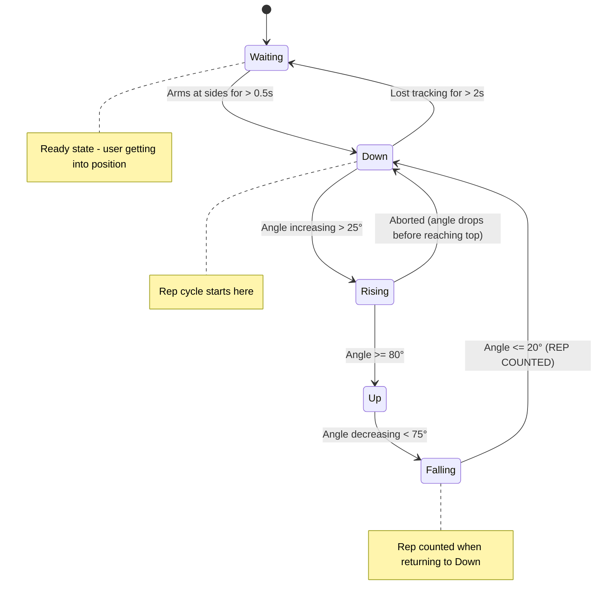
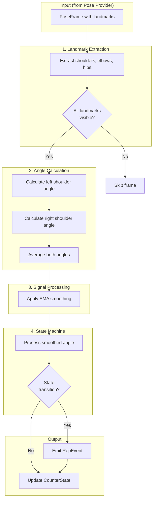

# Lateral Raise Counter Design

> **Issue**: [MVP: Count the reps of Lateral Raises](https://github.com/jinzishuai/fitnessPipe/issues/21)  
> **Related**: [Issue #23 - Modular Architecture](https://github.com/jinzishuai/fitnessPipe/issues/23)  
> **Created**: 2026-01-11  
> **Status**: ✅ Design Approved

---

## Confirmed Decisions

| Decision | Answer |
|----------|--------|
| **When to count rep** | When arms return to bottom position |
| **Arm requirement** | Both arms must move together |
| **MVP scope** | Just rep counts (no form feedback) |
| **Thresholds** | Hardcode defaults, but design for easy exposure later |
| **App entry point** | Dropdown menu to select "Lateral Raise" from exercise list |
| **UI display** | Rep counter + phase + debug angle, overlay on camera preview |
| **Session management** | Manual Reset button (sufficient for MVP) |
| **Tests** | Part of MVP, can be follow-up issue/PR |
| **PoseFrame model** | Use `Map<LandmarkId, Landmark>` pattern |

---

## 1. Exercise Overview

### What is a Lateral Raise?

A lateral raise (also called side raise) is a shoulder isolation exercise where the arms are raised out to the sides until approximately shoulder height, then lowered back down.

```
    START POSITION              END POSITION (top)
    
         O                           O
        /|\                        --|--
        / \                         / \
    (arms down)              (arms horizontal)
```

### Key Movement Characteristics

| Phase | Arm Position | Shoulder Angle |
|-------|-------------|----------------|
| **Start/Bottom** | Arms at sides | ~0-15° |
| **Top** | Arms horizontal | ~80-100° |
| **Full ROM** | Side to shoulder height | 0° → 90° → 0° |

---

## 2. Landmarks Required

For lateral raise detection, we need a **minimal subset** of pose landmarks:

```
        Nose (optional, for facing detection)
          |
    L Shoulder --- R Shoulder
         |              |
    L Elbow        R Elbow
         |              |
    L Wrist        R Wrist
         |              |
    L Hip  -------- R Hip
```

### Required Landmarks (6 minimum)

| Landmark | ID | Purpose |
|----------|-----|---------|
| `leftShoulder` | 11 | Angle vertex for left arm |
| `rightShoulder` | 12 | Angle vertex for right arm |
| `leftElbow` | 13 | Arm direction (left) |
| `rightElbow` | 14 | Arm direction (right) |
| `leftHip` | 23 | Body reference (left) |
| `rightHip` | 24 | Body reference (right) |

### Optional (for enhanced detection)

| Landmark | Purpose |
|----------|---------|
| `leftWrist` / `rightWrist` | Arm extension validation |
| `nose` | Facing direction detection |

---

## 3. Angle Calculation

### Primary Angle: Shoulder Abduction Angle

The key metric is the angle between the **upper arm** and the **torso**.

```
                  * Elbow
                 /
                /  θ (shoulder angle)
               /
    Shoulder *----------* Hip (torso line)
```

#### Mathematical Formula

For the **left arm**:

```
Vector A = Elbow - Shoulder     (arm direction)
Vector B = Hip - Shoulder       (torso direction, pointing down)

θ = arccos( (A · B) / (|A| × |B|) )
```

In code:

```dart
/// Calculate the shoulder abduction angle (arm raised from body)
double calculateShoulderAngle({
  required Landmark shoulder,
  required Landmark elbow,
  required Landmark hip,
}) {
  // Vector from shoulder to elbow (arm direction)
  final armX = elbow.x - shoulder.x;
  final armY = elbow.y - shoulder.y;
  
  // Vector from shoulder to hip (torso direction)
  final torsoX = hip.x - shoulder.x;
  final torsoY = hip.y - shoulder.y;
  
  // Dot product
  final dot = armX * torsoX + armY * torsoY;
  
  // Magnitudes
  final armMag = sqrt(armX * armX + armY * armY);
  final torsoMag = sqrt(torsoX * torsoX + torsoY * torsoY);
  
  // Angle in radians, then convert to degrees
  final cosAngle = dot / (armMag * torsoMag);
  final angleRad = acos(cosAngle.clamp(-1.0, 1.0));
  
  return angleRad * 180 / pi;  // Convert to degrees
}
```

### Handling Both Arms

For lateral raises, we should track **both arms** and use the average or require both to move:

```dart
class LateralRaiseAngles {
  final double leftShoulderAngle;
  final double rightShoulderAngle;
  
  /// Average angle of both arms
  double get averageAngle => (leftShoulderAngle + rightShoulderAngle) / 2;
  
  /// Are both arms reasonably synchronized?
  bool get armsSymmetric => 
      (leftShoulderAngle - rightShoulderAngle).abs() < 20; // degrees
}
```

---

## 4. State Machine Design

### States



### State Definitions

| State | Condition | Description |
|-------|-----------|-------------|
| **Waiting** | No stable pose or user not in position | Getting ready |
| **Down** | Angle < 20° held for 0.5s | Arms at sides, ready to start |
| **Rising** | Angle increasing, 25° < angle < 80° | Lifting phase |
| **Up** | Angle >= 80° | Top of movement |
| **Falling** | Angle decreasing, 20° < angle < 75° | Lowering phase |

### Transition Logic

```dart
enum LateralRaisePhase { waiting, down, rising, up, falling }

class LateralRaiseStateMachine {
  LateralRaisePhase _phase = LateralRaisePhase.waiting;
  int _repCount = 0;
  double _lastAngle = 0;
  DateTime? _stableStartTime;  // For ready state detection
  
  // Thresholds with hysteresis (different entry/exit values)
  static const double _bottomThreshold = 20.0;    // degrees
  static const double _risingThreshold = 25.0;    // exit Down (hysteresis)
  static const double _topThreshold = 80.0;       // enter Up
  static const double _fallingThreshold = 75.0;   // exit Up (hysteresis)
  static const Duration _readyHoldTime = Duration(milliseconds: 500);
  
  RepEvent? processAngle(double angle, DateTime timestamp) {
    RepEvent? event;
    
    switch (_phase) {
      case LateralRaisePhase.waiting:
        // Ready state: user must hold arms down for _readyHoldTime
        if (angle < _bottomThreshold) {
          _stableStartTime ??= timestamp;
          if (timestamp.difference(_stableStartTime!) >= _readyHoldTime) {
            _phase = LateralRaisePhase.down;
            event = RepEvent.exerciseStarted;
          }
        } else {
          _stableStartTime = null;  // Reset if arms not down
        }
        break;
        
      case LateralRaisePhase.down:
        if (angle > _risingThreshold) {  // Hysteresis: 25° not 20°
          _phase = LateralRaisePhase.rising;
        }
        break;
        
      case LateralRaisePhase.rising:
        if (angle >= _topThreshold) {
          _phase = LateralRaisePhase.up;
        } else if (angle < _bottomThreshold) {
          // Aborted rep - went back down without reaching top
          _phase = LateralRaisePhase.down;
        }
        break;
        
      case LateralRaisePhase.up:
        if (angle < _fallingThreshold) {  // Hysteresis: 75° not 80°
          _phase = LateralRaisePhase.falling;
        }
        break;
        
      case LateralRaisePhase.falling:
        if (angle <= _bottomThreshold) {
          _phase = LateralRaisePhase.down;
          _repCount++;
          event = RepEvent.repCompleted;
        } else if (angle >= _topThreshold) {
          // Went back up without completing
          _phase = LateralRaisePhase.up;
        }
        break;
    }
    
    _lastAngle = angle;
    return event;
  }
  
  int get repCount => _repCount;
  LateralRaisePhase get phase => _phase;
}
```

---

## 5. Signal Processing

### Problem: Noisy Pose Data

Raw pose detection produces noisy angle readings:

```
Frame 1: 45.2°
Frame 2: 48.7°  ← spike
Frame 3: 44.8°
Frame 4: 45.5°
Frame 5: 43.1°  ← dip
```

This causes false state transitions.

### Solution: Exponential Moving Average (EMA)

```dart
class AngleSmoother {
  double _smoothedAngle = 0;
  final double _alpha;  // Smoothing factor (0-1)
  
  /// Higher alpha = more responsive, more noise
  /// Lower alpha = smoother, more lag
  AngleSmoother({double alpha = 0.3}) : _alpha = alpha;
  
  double smooth(double rawAngle) {
    _smoothedAngle = _alpha * rawAngle + (1 - _alpha) * _smoothedAngle;
    return _smoothedAngle;
  }
}
```

### Recommended Settings

| Scenario | Alpha | Latency | Noise Rejection |
|----------|-------|---------|-----------------|
| Fast movements | 0.5 | Low | Lower |
| Normal (default) | 0.3 | Medium | Good |
| Very noisy | 0.15 | Higher | Excellent |

---

## 6. Temporal Safeguards

Time-based validation prevents false positives and handles edge cases.

### 6.1 Minimum Rep Duration

Reject impossibly fast reps (likely noise):

```dart
static const Duration _minRepDuration = Duration(milliseconds: 500);

DateTime? _repStartTime;

RepEvent? processAngle(double angle) {
  // When transitioning from Down to Rising, start timer
  if (_phase == LateralRaisePhase.down && angle > _bottomThreshold) {
    _repStartTime = DateTime.now();
  }
  
  // When completing rep, check duration
  if (repCompleted) {
    final duration = DateTime.now().difference(_repStartTime!);
    if (duration < _minRepDuration) {
      // Too fast - likely noise, don't count
      return null;
    }
    return RepCompleted(repCount: ++_count, duration: duration);
  }
}
```

### 6.2 Maximum Rep Duration (Timeout)

Reset if someone holds position too long or stops mid-rep:

```dart
static const Duration _maxRepDuration = Duration(seconds: 5);

void _checkTimeout() {
  if (_repStartTime != null) {
    if (DateTime.now().difference(_repStartTime!) > _maxRepDuration) {
      // Reset - they probably stopped exercising
      _phase = LateralRaisePhase.idle;
      _repStartTime = null;
    }
  }
}
```

### 6.3 Debounce at Thresholds

Prevent rapid oscillation when angle hovers near threshold boundaries:

```dart
DateTime? _lastStateChange;
static const Duration _debounceTime = Duration(milliseconds: 100);

bool _canChangeState() {
  if (_lastStateChange == null) return true;
  return DateTime.now().difference(_lastStateChange!) > _debounceTime;
}

// In state transition logic:
if (_canChangeState() && angle >= _topThreshold) {
  _phase = LateralRaisePhase.up;
  _lastStateChange = DateTime.now();
}
```

### 6.4 Velocity Detection (Optional Enhancement)

Track angular velocity to detect momentum/swinging:

```dart
class VelocityTracker {
  double? _lastAngle;
  DateTime? _lastTime;
  
  /// Returns angular velocity in degrees per second
  double? getVelocity(double currentAngle, DateTime now) {
    if (_lastAngle == null || _lastTime == null) {
      _lastAngle = currentAngle;
      _lastTime = now;
      return null;
    }
    
    final deltaAngle = currentAngle - _lastAngle!;
    final deltaSeconds = now.difference(_lastTime!).inMilliseconds / 1000.0;
    
    _lastAngle = currentAngle;
    _lastTime = now;
    
    return deltaSeconds > 0 ? deltaAngle / deltaSeconds : null;
  }
}

// Usage: Flag suspiciously fast movement (likely swinging)
static const double _maxVelocity = 300.0;  // degrees/second

if (velocity != null && velocity.abs() > _maxVelocity) {
  // User might be swinging arms using momentum
  // For MVP: just note it; for future: form warning
}
```

### 6.5 Summary of Temporal Parameters

| Parameter | Default | Purpose |
|-----------|---------|---------|
| `minRepDuration` | 500ms | Reject impossibly fast reps |
| `maxRepDuration` | 5s | Timeout stalled/incomplete reps |
| `debounceTime` | 100ms | Prevent jitter at thresholds |
| `readyHoldTime` | 500ms | Time to hold start position |
| `maxVelocity` | 300°/s | Detect momentum swinging (optional) |

---

## 7. Complete Algorithm Flow



---

## 8. API Design

### Input

```dart
/// Standard landmark identifiers (matches MediaPipe 33)
enum LandmarkId {
  // Required for lateral raise
  leftShoulder, rightShoulder,
  leftElbow, rightElbow,
  leftHip, rightHip,
  
  // Full set available for other exercises
  nose,
  leftEyeInner, leftEye, leftEyeOuter,
  rightEyeInner, rightEye, rightEyeOuter,
  leftEar, rightEar,
  mouthLeft, mouthRight,
  leftWrist, rightWrist,
  leftPinky, rightPinky,
  leftIndex, rightIndex,
  leftThumb, rightThumb,
  leftKnee, rightKnee,
  leftAnkle, rightAnkle,
  leftHeel, rightHeel,
  leftFootIndex, rightFootIndex,
}

/// A single point in normalized 3D space
class Landmark {
  final double x;          // 0.0 - 1.0 normalized
  final double y;          // 0.0 - 1.0 normalized
  final double z;          // Relative depth
  final double confidence; // 0.0 - 1.0
  
  const Landmark({
    required this.x,
    required this.y,
    this.z = 0,
    required this.confidence,
  });
  
  bool get isVisible => confidence > 0.5;
}

/// A frame of pose data (provider-agnostic)
class PoseFrame {
  final Map<LandmarkId, Landmark> landmarks;
  final DateTime timestamp;
  
  const PoseFrame({
    required this.landmarks,
    required this.timestamp,
  });
  
  /// Get a specific landmark
  Landmark? operator [](LandmarkId id) => landmarks[id];
  
  /// Check if all required landmarks are present and visible
  bool hasLandmarks(Set<LandmarkId> required) {
    return required.every((id) => landmarks[id]?.isVisible ?? false);
  }
}
```

### Output

```dart
/// Events emitted by the counter
sealed class RepEvent {
  const RepEvent();
}

class RepCompleted extends RepEvent {
  final int totalReps;
  final Duration repDuration;
  final double peakAngle;     // How high arms went
  
  const RepCompleted({
    required this.totalReps,
    required this.repDuration,
    required this.peakAngle,
  });
}

class ExerciseStarted extends RepEvent {
  const ExerciseStarted();
}

class PhaseChanged extends RepEvent {
  final LateralRaisePhase newPhase;
  final double currentAngle;
  
  const PhaseChanged({
    required this.newPhase,
    required this.currentAngle,
  });
}
```

### Counter Interface

```dart
/// Main entry point for lateral raise counting
class LateralRaiseCounter {
  final AngleSmoother _smoother;
  final LateralRaiseStateMachine _stateMachine;
  
  LateralRaiseCounter({
    double smoothingFactor = 0.3,
    double bottomThreshold = 20.0,
    double topThreshold = 80.0,
  });
  
  /// Process a pose frame, returns event if state changed
  RepEvent? processPose(PoseFrame frame);
  
  /// Current state
  LateralRaiseState get state;
  
  /// Reset counter
  void reset();
}

class LateralRaiseState {
  final int repCount;
  final LateralRaisePhase phase;
  final double currentAngle;
  final double smoothedAngle;
}
```

---

## 9. Tunable Parameters

| Parameter | Default | Range | Purpose |
|-----------|---------|-------|---------|
| `bottomThreshold` | 20° | 10-30° | When arms considered "down" |
| `topThreshold` | 80° | 70-100° | When rep is counted as "up" |
| `hysteresis` | 5° | 3-10° | Prevents jitter at thresholds |
| `smoothingAlpha` | 0.3 | 0.1-0.5 | Noise filtering strength |
| `minRepDuration` | 500ms | 300-1000ms | Reject impossibly fast reps |
| `maxRepDuration` | 5s | 3-10s | Timeout for incomplete reps |

---

## 10. Edge Cases & Validation

### Edge Case 1: One Arm Only

User might do single-arm lateral raises:

```dart
// If only one arm is visible with good confidence,
// use that arm's angle instead of average
if (leftArm.isVisible && !rightArm.isVisible) {
  return leftShoulderAngle;
} else if (rightArm.isVisible && !leftArm.isVisible) {
  return rightShoulderAngle;
} else {
  return (leftShoulderAngle + rightShoulderAngle) / 2;
}
```

### Edge Case 2: Asymmetric Movement

User raises arms unevenly:

```dart
// Warn if arms differ by more than 25°
if ((leftAngle - rightAngle).abs() > 25) {
  emit(FormWarning('Keep both arms at the same height'));
}
```

### Edge Case 3: Partial Reps

User doesn't reach full ROM:

```dart
// Track peak angle during rising phase
if (_phase == LateralRaisePhase.rising) {
  _currentPeakAngle = max(_currentPeakAngle, angle);
}

// On rep complete, report quality
if (repCompleted) {
  final quality = _currentPeakAngle / _topThreshold;
  // quality < 1.0 means partial rep
}
```

### Edge Case 4: Lost Tracking

Pose detection loses the person mid-rep:

```dart
// If no valid pose for N consecutive frames, reset to Idle
if (_framesWithoutPose > 10) {
  _phase = LateralRaisePhase.idle;
  _currentRepStartTime = null;
}
```

---

## 11. Testing Strategy

### Unit Tests

```dart
void main() {
  group('AngleSmoother', () {
    test('smooths noisy signal', () {
      final smoother = AngleSmoother(alpha: 0.3);
      final raw = [45.0, 48.0, 44.0, 46.0, 45.0];
      final smoothed = raw.map(smoother.smooth).toList();
      
      // Verify reduced variance
      expect(variance(smoothed), lessThan(variance(raw)));
    });
  });
  
  group('LateralRaiseStateMachine', () {
    test('counts a complete rep', () {
      final sm = LateralRaiseStateMachine();
      
      // Simulate: start low, go up, come down
      sm.processAngle(10);   // Down
      sm.processAngle(45);   // Rising
      sm.processAngle(85);   // Up
      sm.processAngle(50);   // Falling
      final event = sm.processAngle(15);  // Down again
      
      expect(event, isA<RepCompleted>());
      expect(sm.repCount, equals(1));
    });
    
    test('ignores partial reps', () {
      final sm = LateralRaiseStateMachine();
      
      sm.processAngle(10);   // Down
      sm.processAngle(50);   // Rising
      sm.processAngle(30);   // Back down without reaching top
      sm.processAngle(10);   // Down
      
      expect(sm.repCount, equals(0)); // No rep counted
    });
  });
}
```

### Integration Test Data

Record sample pose sequences for:
1. Perfect form lateral raises (10 reps)
2. Partial ROM raises
3. Single-arm raises
4. Fast tempo raises
5. Slow controlled raises

---

## 12. UI Integration

### 12.1 Exercise Selector (Dropdown Menu)

Add a dropdown to the existing camera screen to select the exercise:

```dart
class ExerciseSelectorDropdown extends StatelessWidget {
  final ExerciseType? selectedExercise;
  final ValueChanged<ExerciseType?> onChanged;
  
  @override
  Widget build(BuildContext context) {
    return DropdownButton<ExerciseType>(
      value: selectedExercise,
      hint: Text('Select Exercise'),
      items: [
        DropdownMenuItem(
          value: ExerciseType.lateralRaise,
          child: Text('Lateral Raise'),
        ),
        // Future exercises will be added here
      ],
      onChanged: onChanged,
    );
  }
}

enum ExerciseType {
  lateralRaise,
  // squat,     // Future
  // pushup,    // Future
}
```

### 12.2 Counter Overlay (On Camera Preview)

Display rep count, phase, and angle overlaid on the camera:

```dart
class RepCounterOverlay extends StatelessWidget {
  final int repCount;
  final LateralRaisePhase phase;
  final double currentAngle;  // Debug info
  
  @override
  Widget build(BuildContext context) {
    return Positioned(
      top: 20,
      left: 20,
      child: Container(
        padding: EdgeInsets.all(16),
        decoration: BoxDecoration(
          color: Colors.black54,
          borderRadius: BorderRadius.circular(12),
        ),
        child: Column(
          crossAxisAlignment: CrossAxisAlignment.start,
          children: [
            // Rep count (large)
            Text(
              '$repCount',
              style: TextStyle(
                fontSize: 48,
                fontWeight: FontWeight.bold,
                color: Colors.white,
              ),
            ),
            Text(
              'reps',
              style: TextStyle(fontSize: 16, color: Colors.white70),
            ),
            SizedBox(height: 8),
            
            // Phase indicator
            _buildPhaseChip(phase),
            
            SizedBox(height: 4),
            
            // Debug: current angle
            Text(
              'Angle: ${currentAngle.toStringAsFixed(1)}°',
              style: TextStyle(fontSize: 12, color: Colors.white54),
            ),
          ],
        ),
      ),
    );
  }
  
  Widget _buildPhaseChip(LateralRaisePhase phase) {
    final (label, color) = switch (phase) {
      LateralRaisePhase.waiting => ('Ready...', Colors.grey),
      LateralRaisePhase.down => ('Down', Colors.blue),
      LateralRaisePhase.rising => ('Rising ↑', Colors.orange),
      LateralRaisePhase.up => ('Up!', Colors.green),
      LateralRaisePhase.falling => ('Lowering ↓', Colors.orange),
    };
    
    return Container(
      padding: EdgeInsets.symmetric(horizontal: 8, vertical: 4),
      decoration: BoxDecoration(
        color: color,
        borderRadius: BorderRadius.circular(4),
      ),
      child: Text(label, style: TextStyle(color: Colors.white)),
    );
  }
}
```

### 12.3 Screen Layout

```
┌────────────────────────────────────┐
│  ┌──────────────────┐              │
│  │ Lateral Raise  ▼ │  ← Dropdown  │
│  └──────────────────┘              │
│                                    │
│  ┌──────────────────────────────┐  │
│  │                              │  │
│  │                              │  │
│  │      CAMERA PREVIEW          │  │
│  │                              │  │
│  │  ┌─────────┐                 │  │
│  │  │  12     │  ← Overlay      │  │
│  │  │  reps   │                 │  │
│  │  │ Rising ↑│                 │  │
│  │  │ 45.2°   │                 │  │
│  │  └─────────┘                 │  │
│  │                              │  │
│  │     (skeleton overlay)       │  │
│  │                              │  │
│  └──────────────────────────────┘  │
│                                    │
│  [ Reset ]                         │
└────────────────────────────────────┘
```

### 12.4 Integration with Pose Stream

```dart
class PoseDetectionScreen extends StatefulWidget {
  // ... existing code
}

class _PoseDetectionScreenState extends State<PoseDetectionScreen> {
  ExerciseType? _selectedExercise;
  LateralRaiseCounter? _counter;
  int _repCount = 0;
  LateralRaisePhase _phase = LateralRaisePhase.waiting;
  double _currentAngle = 0;
  
  @override
  void initState() {
    super.initState();
    // ... existing camera init
  }
  
  void _onExerciseSelected(ExerciseType? type) {
    setState(() {
      _selectedExercise = type;
      if (type == ExerciseType.lateralRaise) {
        _counter = LateralRaiseCounter();
      } else {
        _counter = null;
      }
      _repCount = 0;
    });
  }
  
  void _onPoseDetected(Pose pose) {
    // Convert app's Pose to counter's PoseFrame
    if (_counter != null && _selectedExercise != null) {
      final frame = _poseAdapter.convert(pose);
      final event = _counter!.processPose(frame);
      
      setState(() {
        _currentAngle = _counter!.state.currentAngle;
        _phase = _counter!.state.phase;
        
        if (event is RepCompleted) {
          _repCount = event.totalReps;
          // Optional: haptic feedback
          HapticFeedback.mediumImpact();
        }
      });
    }
  }
  
  @override
  Widget build(BuildContext context) {
    return Scaffold(
      body: Stack(
        children: [
          // Camera preview (existing)
          CameraPreview(...),
          
          // Skeleton overlay (existing)
          SkeletonOverlay(...),
          
          // Exercise selector (top)
          Positioned(
            top: 50,
            left: 16,
            child: ExerciseSelectorDropdown(
              selectedExercise: _selectedExercise,
              onChanged: _onExerciseSelected,
            ),
          ),
          
          // Rep counter overlay
          if (_selectedExercise != null)
            RepCounterOverlay(
              repCount: _repCount,
              phase: _phase,
              currentAngle: _currentAngle,
            ),
          
          // Reset button
          Positioned(
            bottom: 20,
            left: 16,
            child: ElevatedButton(
              onPressed: () {
                _counter?.reset();
                setState(() => _repCount = 0);
              },
              child: Text('Reset'),
            ),
          ),
        ],
      ),
    );
  }
}
```

---

## 13. Implementation Plan

### Phase 1: Package Setup (in `packages/fitness_counter/`)

| Task | File | Description |
|------|------|-------------|
| 1.1 | `pubspec.yaml` | Create package with no dependencies |
| 1.2 | `lib/src/models/landmark.dart` | `Landmark`, `LandmarkId` enum |
| 1.3 | `lib/src/models/pose_frame.dart` | `PoseFrame` class |
| 1.4 | `lib/src/models/counter_event.dart` | `RepEvent`, `RepCompleted`, `PhaseChanged` |
| 1.5 | `lib/src/core/angle_calculator.dart` | `calculateShoulderAngle()` function |
| 1.6 | `lib/src/core/smoothing.dart` | `AngleSmoother` class (EMA) |
| 1.7 | `lib/src/exercises/lateral_raise.dart` | `LateralRaiseCounter`, state machine |
| 1.8 | `lib/fitness_counter.dart` | Public API exports |

### Phase 2: Unit Tests (in `packages/fitness_counter/test/`)

| Task | File | Description |
|------|------|-------------|
| 2.1 | `angle_calculator_test.dart` | Test angle calculation with known values |
| 2.2 | `smoothing_test.dart` | Test EMA reduces variance |
| 2.3 | `lateral_raise_test.dart` | Test state machine transitions, rep counting |

### Phase 3: App Integration (in `lib/`)

| Task | File | Description |
|------|------|-------------|
| 3.1 | `pubspec.yaml` | Add `path: packages/fitness_counter` dependency |
| 3.2 | `lib/core/adapters/pose_adapter.dart` | Convert `Pose` → `PoseFrame` |
| 3.3 | `lib/presentation/widgets/exercise_selector.dart` | Dropdown widget |
| 3.4 | `lib/presentation/widgets/rep_counter_overlay.dart` | Overlay widget |
| 3.5 | `lib/presentation/screens/pose_detection_screen.dart` | Integrate counter + UI |

### Phase 4: Manual Testing & Tuning

| Task | Description |
|------|-------------|
| 4.1 | Test on physical device with real lateral raises |
| 4.2 | Tune thresholds if needed |
| 4.3 | Verify haptic feedback on rep complete |

---

## 14. Verification Plan

### Unit Tests (Automated)

Run from the package directory:
```bash
cd packages/fitness_counter
flutter test
```

**Test cases:**
- `angle_calculator_test.dart`: Arms at 0°, 45°, 90° produce expected angles
- `smoothing_test.dart`: Noisy input produces smoother output with lower variance
- `lateral_raise_test.dart`:
  - Complete rep cycle → `RepCompleted` event
  - Partial rep (doesn't reach top) → no event
  - Too fast rep → rejected
  - Waiting state requires 0.5s hold

### Manual Testing

**Prerequisites:**
- Physical device with camera (iOS or Android)
- Ability to stand in view of camera

**Steps:**
1. Run the app on a physical device
2. Select "Lateral Raise" from dropdown
3. Stand with arms at sides for 0.5s → Should see "Ready" phase
4. Raise arms to shoulder height → Phase should change: Down → Rising → Up
5. Lower arms back down → Phase: Falling → Down, rep count = 1
6. Repeat 5 times → rep count should be 5
7. Tap "Reset" → rep count should be 0

---

## 15. Summary

This design provides a clean, modular lateral raise counter that:

- **Decouples** the counter from the pose provider (works with ML Kit, Apple Vision, or any future provider)
- **Uses minimal landmarks** (just 6 points needed)
- **Handles noise** via EMA smoothing
- **Provides reliable counting** via a well-defined state machine
- **Is testable** with clear unit test strategies
- **Has clear UI** with exercise selector and overlay

**Ready for implementation!**

